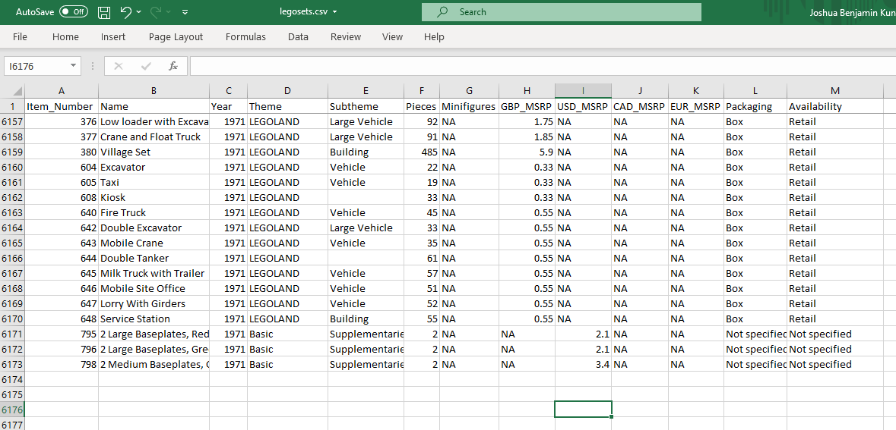
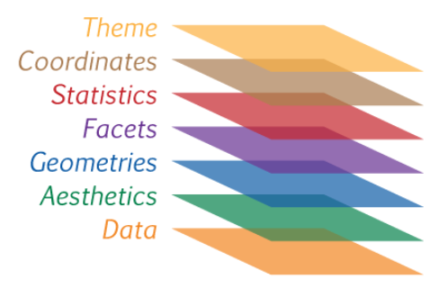

```{r setup, include=FALSE}
source(here::here("slides/xaringan-knitr-setup.R"))

library(flipbookr)
```

## Análisis Exploratorio de Datos

El **Análisis Exploratorio de Datos** se refiere a un ciclo iterativo en el que:

- Generas preguntas acerca de tus datos.
- Buscas respuestas visualizando, transformando y modelando tus datos.
- Usas lo que has aprendido para refinar tus preguntas y/o generar nuevas interrogantes.

Lo anterior es un _copy & paste_ desde [R4DS](https://es.r4ds.hadley.nz/an%C3%A1lisis-exploratorio-de-datos-eda.html#an%C3%A1lisis-exploratorio-de-datos-eda).


```{r out.width="60%", fig.align='center', echo=FALSE}
knitr::include_graphics("images/data-science-explore.svg")
```


---

## Visualización

Definiremos la visualización, en el contexto de análisis de datos, como una manera
de representar/codificar información, y por tanto una herramienta para analizar
datos.

```{r out.width="60%", fig.align='center', echo=FALSE}
knitr::include_graphics("images/data-viz.jpg")
```

---

## Antes de seguir

- Una __variable__ es una cantidad, que puede ser medida: estatura, magnitud de un sismo, velocidad.

- Un __valor__ es un estado de la variable cuando se mide: 1.20 metros, 8° Richter.

- Una __observación__ o caso es un conjunto de mediciones -no de la misma variable necesariamente- pero si en un mismo instante y a un mismo objeto.


```{r out.width="70%", fig.align='center', echo=FALSE}
knitr::include_graphics("images/tidy-1.png")
```

---

## Un primer ejemplo: Set de legos! 

```{r legodata, cache=TRUE, echo=FALSE}
library(tidyverse)
set.seed(123)
legos <- read_csv("https://raw.githubusercontent.com/seankross/lego/master/data-tidy/legosets.csv") |> 
  mutate(year2 = floor(Year/10)*10) |> 
  sample_n(3000)
```

```{r out.width="90%", fig.align='center', echo=FALSE}
# knitr::include_graphics(here::here("202107-visualizacion-desde-el-analsis-de-datos/imgs/data-viz.jpg"))

```

---

## Explorar (v1)

```{r, echo=FALSE}
library(tidyverse)
library(scales)

ggplot(legos) + 
  geom_point(aes(Pieces, USD_MSRP), alpha = 0.25, size = 1) +
  labs(title = "Precio según cantidad de piezas", x = "Piezas", y = "Precio USD")
```

---

## Explorar (v2)

```{r, echo=FALSE}
ggplot(legos) + 
  geom_point(aes(Pieces, USD_MSRP), alpha = 0.25, size = 1) +
  scale_y_sqrt(labels = scales::dollar, limits = c(1, 300)) +
  scale_x_sqrt(labels = scales::comma, limits = c(1, 2000)) +
  labs(title = "Precio según cantidad de piezas", x = "Piezas", y = "Precio USD")
```

---

## Codificamos mayor información. Bueno/Malo?

```{r, echo=FALSE}
ggplot(legos) + 
  geom_point(aes(Pieces, USD_MSRP, size = Minifigures, color = year2), alpha = 0.5) +
  scale_y_sqrt(labels = scales::dollar, limits = c(1, 300)) +
  scale_x_sqrt(labels = scales::comma, limits = c(1, 2000)) +
  scale_size(name = "Piezas") +
  scale_color_viridis_c(name = "", breaks = c(1970, 1980, 1990, 2000, 2010)) +
  labs(title = "Precio según cantidad de piezas", x = "Piezas", y = "Precio USD")
```

---

## Cada visualización cuenta una historia

```{r, echo=FALSE}
fmt_dec <- function(x) {
  
  if(as.numeric(x) == 2000) {
    out <- x
  } else {
    out <- paste(str_extract(x, "[0-9]{2}$"), "'s")
  }
  
  out
  
}

fmt_dec <- Vectorize(fmt_dec)

pl <- ggplot(legos, aes(factor(year2), USD_MSRP)) +
  scale_color_pres_c(breaks = c(1970, 1990, 2010), guide = "none") + 
  scale_size(name = "Piezas") +
  scale_y_continuous(name = "Precio USD", labels = scales::dollar, limits = c(0, 300)) + 
  scale_x_discrete(name = "Década", labels = fmt_dec) +
  labs(title = "Precios por década")

pl +
  geom_point(aes(size = Pieces, color = Year), alpha = 0.5, width = 0.25,
             position = position_jitter(seed = 12)) 
```


---

## Explorar tendencia antes que detalles...

```{r, echo=FALSE}
pl +
  geom_point(aes(size = Pieces, color = Year), alpha = 0.5, width = 0.25,
             position = position_jitter(seed = 12)) +
  geom_boxplot(aes(fill = factor(year2)), width = 0.25, alpha = 0.5,
               color = "gray50", outlier.color = "gray50") +
  scale_fill_viridis_d(breaks = c(1970, 1980, 1990, 2000, 2010), name = NULL) 
```

---

## Explorar tendencia antes que detalles... (v2)

```{r, echo=FALSE}
pl +
  # geom_jitter(aes(size = Pieces, color = Year), alpha = 0.5, width = 0.25) +
  geom_boxplot(aes(fill = factor(year2)), width = 0.25, alpha = 0.85,
               color = "gray50", outlier.color = "gray50") +
  scale_fill_viridis_d(breaks = c(1970, 1980, 1990, 2000, 2010), name = NULL) 
```

---

## O simplemente contar una historia más sencilla

```{r, echo=FALSE}
ggplot(legos, aes(factor(year2))) +
  geom_bar(aes(fill = factor(year2)), width = 0.5, alpha = 0.85) +
  scale_fill_viridis_d(guide = "none") +
  scale_y_continuous(labels = comma) +
  labs(
    title = "Cantidad de sets por década",
    x = "Década",
    y = "Sets"
    )
```


---

## `ggplot2`

```{r out.width="50%", fig.align='center', echo=FALSE}
knitr::include_graphics("images/viz-mapping-vars.png")
```

De forma **general**:

```
ggplot(data = <DATOS>) +
  <GEOM_FUNCIÓN>(mapping = aes(<MAPEOS>))
```

---

## `ggplot2`

```{r out.width="50%", fig.align='center', echo=FALSE}
knitr::include_graphics("images/viz-mapping-vars.png")
```

De forma **particular**:

```
ggplot(data = datos) +
  geom_point(mapping = aes(x = foo, y = bar, size = zaz))
```

---

## `ggplot2` 

`ggplot2` funciona bajo un marco de layers o capas. Estas las iremos agregando
de abajo hacia arriba.

```{r out.width="50%", fig.align='center', echo=FALSE}

```

---

## Revisemos los datos

```{r out.width="70%", fig.align='center'}
library(tidyverse)
library(datos)

glimpse(millas)
```

```{r, include=FALSE}
ggplot2::theme_set(
  ggplot2::theme_gray(base_size = 5) +
    theme(legend.position = "bottom")
)
```

---

```{r millas2, include = FALSE}
ggplot( 
  millas, # data  
  aes(cilindrada, autopista) # aesthetics
) +
  geom_point(aes(color = traccion)) + # geometries
  facet_wrap(vars(anio)) + # facets
  stat_smooth(color = "red", method = "lm") + # stats
  scale_x_continuous(labels = comma_format(suffix = "Lts.")) + # coords
  scale_y_continuous(labels = comma_format(suffix = "Km/l")) + # coords
  theme_minimal(base_size = 5) + # theme
  theme(legend.position = "bottom") + # theme
  # otros
  scale_color_viridis_d() +
  labs(
    title = "Un hermoso título",
    subtitle = "Un bellos y extenso subtítulo",
    caption = "Un texto que nadie mira",
    x = "Cilindrada vehículo cc",
    y = "Rendimiento en autopista km/lts",
    color = "Tipo tracción"
  )
```

`r flipbookr::chunk_reveal("millas2", break_type = "auto", title = "## Ejemplo layers", widths = c(1, 1), chunk_options = "fig.height = 2.7, fig.width = 3")`

---

## Hagamos un _copy & paste_

```{r out.width="70%", fig.align='center'}
library(datos)
library(ggplot2)

ggplot(data = millas) +
  geom_point(mapping = aes(x = cilindrada, y = autopista))
```

---

## Hagamos un _copy & paste_ (v2)

```{r out.width="70%", fig.align='center'}
library(datos)
library(ggplot2)

ggplot(millas) +
  geom_point(aes(cilindrada, autopista))
```

---

## Ejercicio 1: en un script de R:

1. Cargue los paquetes `datos`, `ggplot2` y `dplyr`.
1. Ejecute `glimpse(vuelos)`.
1. Objtenga una _muestra_ de 10.000 registros para responder las preguntas utilizando la funcion `sample_n`. 
1. ¿Cuántos filas/columnas tienen los datos?
1. ¿Cuántos datos son numéricos?
1. Explore la relación entre `distancia` y `tiempo_vuelo`.
1. ¿Qué otras preguntas tienes? ¿Como podríamos obtener QUE vuelo es el más largos?
1. Reutiliza el código del ejemplo paso a paso para utilizar la función `facet_wrap` 
con estos datos.

---

```{r, include=FALSE}
ggplot2::theme_set(
  ggplot2::theme_minimal(base_size = 7) +
  theme(legend.position = "bottom")
)
```

`r flipbookr::chunk_reveal("vuelos_sample", break_type = 5, title = "## Sirve obtener una **muestra**?", widths = c(1, 1), chunk_options = "fig.height = 2.7, fig.width = 3")`

```{r vuelos_sample, include = FALSE}
vuelos2 <- sample_n(vuelos, 5000)

ggplot(vuelos2, aes(distancia, tiempo_vuelo)) +
  geom_point(alpha = 0.05, color = "gray60") +
  geom_smooth(se = FALSE, color = "darkred") +
  scale_x_continuous(labels = scales::comma) +
  scale_y_continuous(limits = c(0, 650))
```

---

.center[
```{r, echo=FALSE, out.width="90%"}
knitr::include_graphics("images/ggplot_elements2.png")
```
]

https://bookdown.org/alapo/learnr/data-visualisation.html

---

## Ejercicio 2: Replique los gráficos de Legos

Para cargar los datos utilice:

```{r eval=FALSE}
library(tidyverse)

set.seed(123)

url_datos <- "https://raw.githubusercontent.com/seankross/lego/master/data-tidy/legosets.csv"

legos <- read_csv(url_datos) |> 
  mutate(year2 = floor(Year/10)*10) |> 
  sample_n(3000)
```

Antes de replicar los gráficos de legos -si bien utiliza funciones que no hemos visto-, interprete el código que lee los datos.

---

## Más información sobre visualización

- [Visualización de datos](https://es.r4ds.hadley.nz/visualizaci%C3%B3n-de-datos.html#introducci%C3%B3n-1) en R4DS.

- A _simple_ intro to `ggplot2`, [link](https://www.rforecology.com/post/a-simple-introduction-to-ggplot2/). 

- Para motivarse: _ggplot Wizardry Hands-On_ , [link](https://z3tt.github.io/OutlierConf2021/). [Cedric Sherer](https://www.cedricscherer.com/)

- Visualización desde el análisis de datos. [Slides](https://jkunst.com/slides/202107-visualizacion-desde-el-analsis-de-datos/index.html).

- Más _flipbooks_ con el paquete [`flipbookr`](https://evamaerey.github.io/flipbooks/about).

- Documentación `ggplot2` https://ggplot2.tidyverse.org/index.html.

- Explorando histogramas, [link](http://tinlizzie.org/histograms/).
