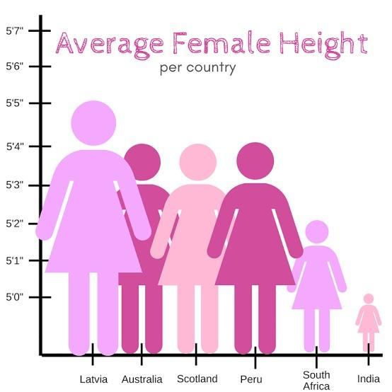
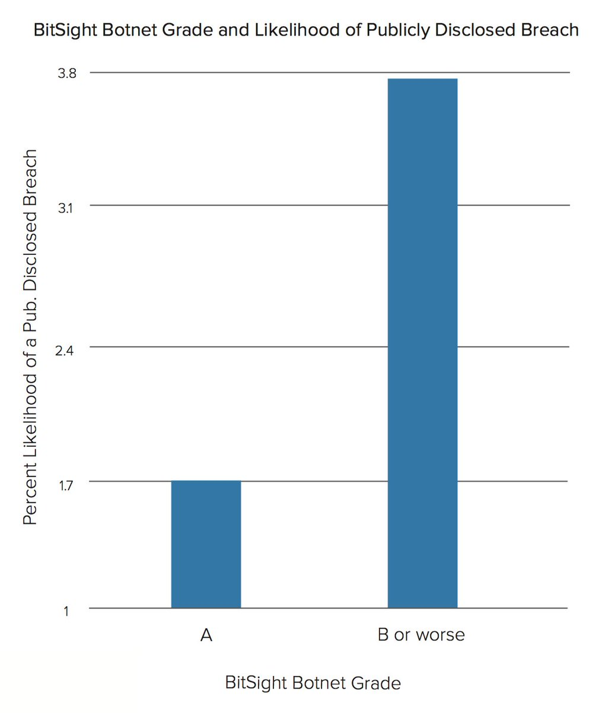
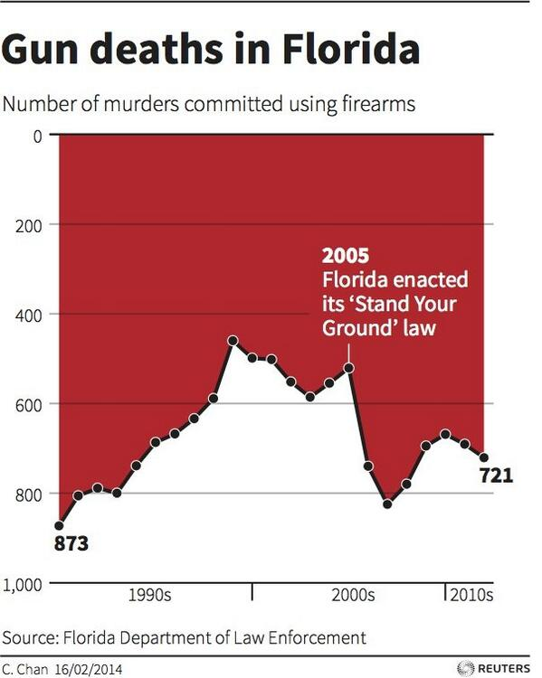
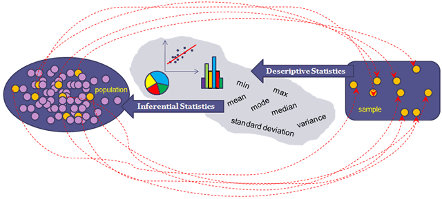

```{r setup, include=FALSE}
source(here::here("slides/xaringan-knitr-setup.R"))
library(flipbookr)
```

## ¿Existe el mejor gráfico? 

Queremos comunicar: _La región del sur exhibe el mayor crecimiento en ventas._

Ejemplo adapatado del tweet de [Lisa Charlotte Rost](https://twitter.com/lisacrost/status/948233069110222848)
que a su vez está viene del ejemplo del libro "Show me the numbers" de Stephen Few


Los datos:

```{r, echo=FALSE}
library(readxl)
library(tidyverse)

datosq <- read_excel(here::here("data/muestrame_los_numeros.xlsx")) |> 
  mutate(region = factor(region, levels = c("sur", "norte", "este", "oeste")))

datosq |> 
  # spread(cuarto, valor) |> 
  arrange(region) |> 
  glimpse() 
```

---

## Opción #1

```{r, echo=FALSE}
sfv <- scale_fill_viridis_d(option = "D", begin = 0.1, end = 0.90)
scv <- scale_color_viridis_d(option = "D", begin = 0.1, end = 0.90)
rmv <- labs(fill = NULL, color = NULL, x = NULL, y = NULL)
ttl <- labs(title = "La región del sur exhibe el mayor crecimiento")

p1 <- ggplot(datosq) +
  geom_col(aes(cuarto, valor, group = region, fill = region),
           color = "gray90", position = "dodge") +
  sfv +
  rmv
  
p1 + ttl
```

---

## Opción #2

```{r, echo=FALSE}
p2 <- ggplot(datosq) +
  geom_col(aes(region, valor, group = cuarto, fill = region),
           color = "gray90", position = "dodge") +
  sfv +
  rmv
  
p2 + ttl
```

---

## Opción #3

```{r, echo=FALSE}
p3 <- ggplot(datosq) +
  geom_line(aes(cuarto, valor, group = region, color = region), size = 2.5) +
  scv +
  rmv

p3 + ttl
```

---

## ¿Cuál es la mejor?

```{r, echo=FALSE}
library(patchwork)

(p1 | p2 | p3) & theme(legend.position = "none") 
```

---

```{r, include=FALSE}
ggplot2::theme_set(theme_flipboork)
```

```{r datosq, include = FALSE}
datosq |> 
  mutate(es_sur = ifelse(region == "sur", 1, 0)) |> 
  ggplot() +
  geom_line(aes(x = cuarto, y = valor,
                group = region, 
                color = es_sur, 
                size = es_sur),
            lineend = "round") +
  scale_color_gradient(low = "#00000020", high = "darkred") +
  scale_size_continuous(range = c(1.5, 3)) +
  scale_y_continuous(position = "right", limits = c(70, 320)) + 
  theme_minimal(base_size = 7) +
  theme(legend.position = "none") +
  labs(
    title = "Sur exhibe el mayor crecimiento con un 234% anual",
    x = NULL, 
    y = NULL
    )
```

`r flipbookr::chunk_reveal("datosq", break_type = "auto", title = "## Otra opción", widths = c(1, 1), chunk_options = "fig.height = 2.7, fig.width = 3")`

---

## Recomendaciones Técnicas <br> y algunas misceláneas

- Tipos de gráficos.
- Puntos de referencia.
- Convenciones.
- Tipografías.
- Colores.
- Etiquetas.


---

## Tipos de gráficos

Es muy usado es el __pie chart__

```{r, include=FALSE}
ggplot2::theme_set(theme_slides)
```

```{r, echo=FALSE}
library(tidyverse)
library(patchwork)
url_datos <- "https://raw.githubusercontent.com/seankross/lego/master/data-tidy/legosets.csv"
legosets <- read_csv(url_datos) |> 
  mutate(year2 = floor(Year/10)*10)
 
legos2 <- legosets |> 
  mutate(Theme2 = fct_lump(Theme, n = 7)) |> 
  filter(Theme2 != "Other")
  
p11 <- ggplot(legos2) +
  geom_bar(aes(Theme, fill = Theme)) +
  scale_fill_viridis_d(option = "B", end = 0.7) +
  theme_null + 
  xlab(NULL) + ylab(NULL)

p21 <- ggplot(legos2) +
  geom_bar(aes(x = factor(1), fill = Theme), width = 1) +
  scale_fill_viridis_d(option = "B", end = 0.7) +
  coord_polar(theta = "y") +
  theme_null

p11 + p21
```

---

## Tipos de gráficos

Es muy (__ab__)usado es el __pie chart__

```{r, echo=FALSE}
legos3 <- legosets |> 
  mutate(Theme2 = fct_lump(Theme, n = 15)) |> 
  filter(Theme2 != "Other")

p12 <- ggplot(legos3) +
  geom_bar(aes(Theme, fill = Theme)) +
  scale_fill_viridis_d(option = "B") +
  theme_null + 
  xlab(NULL) + ylab(NULL)

p22 <- ggplot(legos3) +
  geom_bar(aes(x = factor(1), fill = Theme), width = 1) +
  scale_fill_viridis_d(option = "B") +
  coord_polar(theta = "y") +
  theme_null

p12 + p22
```

---

## El pie para el postre

```{r out.width="60%", fig.align='center', echo=FALSE}
knitr::include_graphics("images/viz/omgpie.gif")
```

---

## Puntos de referencia

```{r, echo=FALSE}
legos2 |> 
  count(Theme) |> 
  ggplot() +
  geom_segment(
    aes(x = Theme, xend = Theme, y = 230, yend = n, color = Theme),
    size = 45
    ) +
  theme_slides +
  labs(color = NULL, x = NULL, y = NULL) +
  scale_color_viridis_d(option = "B") +
  theme(legend.position = "none")
```


---

## Puntos de referencia 2

```{r, echo=FALSE}
p11 +
  theme_slides +
  labs(fill = NULL, x = NULL, y = NULL) +
  scale_fill_viridis_d(option = "B") +
  theme(legend.position = "none")
```

---

## Puntos de referencia 3

```{r out.width="60%", fig.align='center', echo=FALSE}

```

---

## Puntos de referencia 4

```{r, echo=FALSE}
data2 <- data_frame(
  indice = c(30.7, 22.8, 27.3),
  tiempo = c(2010, 2013, 2016),
  c = c("r", "b", "r")
)

ggplot(data2, aes(factor(tiempo), indice)) + 
  geom_col(aes(fill = c), width = 0.30) +
  geom_text(aes(label = paste0(indice, "%")), color = "white", size = 5, vjust = 2) +
  scale_fill_manual(values = c("#156ec9", "#ec243d")) +
  labs(x = "Año", y = "Índice") + 
  theme(axis.text.y = element_blank(), legend.position="none")
```

---

## Puntos de referencia 5

```{r out.width="50%", fig.align='center', echo=FALSE}

```

<small>https://twitter.com/lizardbill/status/1127005323636686848</small>
---

## Convenciones: Encuentre las anomalías

```{r out.width="40%", fig.align='center', echo=FALSE}

```

---

## Convenciones: ¿Dónde se produce el máximo?

```{r out.width="40%", fig.align='center', echo=FALSE}

```

---

## Tipografía

¿Conocen a ...?

<span class="fragment"><h1><font face="Arial">Arial</font></h1></span>
<span class="fragment"><h1><font face="Times New Roman">Times New Roman</font></h1></span>
<span class="fragment"><h1><font face="Comic Sans MS">Comic Sans</font></h1></span>

Fuentes tienen personalidad y un propósito.

---

## Tipografía2

Fuente: https://comicsanscriminal.com/

```{r out.width="80%", fig.align='center', echo=FALSE}

```

---

## Colores

La misma idea de las convenciones!

- Dar foco y llamar la atención
- Debiesen ser corcondantes con el dato

---

## Colores 2

```{r, echo=FALSE}
df <- tibble(
  pais = c("Chile", "Colombia", "Argentina", "Bolivia"),
  crecimiento = c(6, 5, 4, 4)/10
) |> 
  mutate(pais = fct_inorder(pais))

p5 <- ggplot(df) +
  geom_col(aes(pais, crecimiento, fill = pais), width = 0.5) + 
  scale_y_continuous(labels = scales::percent) +
  scale_fill_manual(values = sample(c("#C8152B", "#FDD116", "#4F75AF", "#2C9A05"))) +
  theme(legend.position = "none")

p5
```

---

## Colores 3

```{r, echo=FALSE}
p6 <- ggplot(df) +
  geom_col(aes(pais, crecimiento, fill = pais), width = 0.5) +
  scale_y_continuous(labels = scales::percent) +
  scale_fill_manual(values = c("#d02a1e", "gray80", "gray80", "gray80")) +
  theme(legend.position = "none")

p6
```

---

## Etiquetas

```{r, echo=FALSE}
dg2 <- gapminder::gapminder |> 
  group_by(country) |> 
  filter(row_number() == n()) |> 
  ungroup()

p9 <- ggplot(dg2) + 
  geom_point(aes(lifeExp, gdpPercap, size = pop, color = continent), alpha = 0.7) +
  scale_color_viridis_d(option = "A") + 
  scale_y_sqrt(name = "GDP per Capita", labels = scales::comma, limits = c(NA, NA)) +
  scale_x_continuous(name = "Esperanza de vida", labels = scales::comma, limits = c(NA, NA)) +
  scale_size(labels = scales::comma, range = c(3, 10), breaks = c(100, 1000, 2000)*1e6) +
  labs(title = "Esperanza de vida y GDP per capita ")

p9
```

---

## Etiquetas 2

```{r, echo=FALSE}
p10 <- ggplot(dg2) + 
  geom_point(aes(lifeExp, gdpPercap, size = pop, color = continent), alpha = 0.7) +
  geom_label(aes(lifeExp, gdpPercap, label = country, size = pop, color = continent), alpha = 0.7) +
  scale_color_viridis_d(option = "A") + 
  scale_y_sqrt(name = "GDP per Capita", labels = scales::comma, limits = c(NA, NA)) +
  scale_x_continuous(name = "Esperanza de vida", labels = scales::comma, limits = c(NA, NA)) +
  scale_size(labels = scales::comma, range = c(3, 10), breaks = c(100, 1000, 2000)*1e6) +
  labs(title = "Esperanza de vida y GDP per capita ")
p10
```

---

## Etiquetas 3

```{r, echo=FALSE}
library(ggrepel)

p11 <- ggplot(dg2) + 
  geom_point(aes(lifeExp, gdpPercap, size = pop, color = continent), alpha = 0.7) +
  geom_label_repel(aes(lifeExp, gdpPercap, label = country, size = pop, color = continent), alpha = 0.7) +
  scale_color_viridis_d(option = "A") + 
  scale_y_sqrt(name = "GDP per Capita", labels = scales::comma, limits = c(NA, NA)) +
  scale_x_continuous(name = "Esperanza de vida", labels = scales::comma, limits = c(NA, NA)) +
  scale_size(labels = scales::comma, range = c(3, 10), breaks = c(100, 1000, 2000)*1e6) +
  labs(title = "Esperanza de vida y GDP per capita ")

p11
```

---

## Etiquetas 4

```{r, echo=FALSE}
set.seed(123)
dg3 <- dg2 |> 
  sample_n(10)

p12 <- ggplot(dg2) + 
  geom_point(aes(lifeExp, gdpPercap, size = pop, color = continent), alpha = 0.7) +
  geom_label_repel(aes(lifeExp, gdpPercap, label = country), color = "gray40", data = dg3, force = 100) +
  scale_color_viridis_d(option = "A") + 
  scale_y_sqrt(name = "GDP per Capita", labels = scales::comma, limits = c(NA, NA)) +
  scale_x_continuous(name = "Esperanza de vida", labels = scales::comma, limits = c(NA, NA)) +
  scale_size(labels = scales::comma, range = c(3, 10), breaks = c(100, 1000, 2000)*1e6) +
  labs(title = "Esperanza de vida y GDP per capita ")

p12
```

---

## Estadística Descriptiva: Ejercicio motivacional

Supongamos que debemos decidir en curso debe ir nuestro hijo/sobrino/simil, entre el curso _naranjo_ o _azul_. Nos dicen que el promedio de notas finales del año anterior para cada curso fue.

```{r, echo=FALSE}
set.seed(123)

N <- 50
curso2 <- rgamma(N, scale = 6.5, shape = 1)
curso2 <- curso2 + rnorm(N)*2
curso2 <- ifelse(curso2 < 4, 4, curso2)
curso2 <- ifelse(curso2 > 7, 7, curso2)

curso1 <- rnorm(50, mean = mean(curso2) - 0.2, sd = 0.25)
curso1 <- ifelse(curso1 < 4, 4, curso1)
curso1 <- ifelse(curso1 > 7, 7, curso1)

# summary(curso1)
# hist(curso1, breaks = 10)
df <- data_frame(
  curso = rep(c("azul", "naranjo"), each = N),
  nota = c(curso2, curso1)
)

df |> 
  group_by(curso) |> 
  summarise(
    cantidad_de_alumnos = n(),
    promedio = mean(nota)
    ) |>
  mutate_if(is.numeric, round, 2) |> 
  knitr::kable()
```

---

## Ejercicio motivacional cont

Más información, mínimo y máximos:

```{r, echo=FALSE}
df |> 
  group_by(curso) |> 
  summarise(
    cantidad_de_alumnos = n(),
    promedio = mean(nota),
    maxima_nota = max(nota)
    ) |>
  mutate_if(is.numeric, round, 2) |> 
  knitr::kable()
```

---

## Ejercicio motivacional cont 2

```{r, echo=FALSE}
ggplot(df) + 
  geom_histogram(aes(nota, fill = curso)) + 
  facet_wrap(vars(curso)) + 
  scale_fill_viridis_d(begin = .2, end = .8, option = "B") 
```

---

## Ejercicio motivacional cont 3

Quizás un poco más de información ayuda:

```{r, echo=FALSE}
df |> 
  group_by(curso) |> 
  summarise(
    cantidad_de_alumnos = n(),
    promedio = mean(nota),
    desviacion_estandiar = sd(nota),
    mediana = median(nota),
    minimo = min(nota),
    maximo = max(nota)
    ) |> 
  gather(estadistico, valor, -curso) |> 
  spread(curso, valor) |>
  mutate_if(is.numeric, round, 2) |> 
  knitr::kable()
```

---

## Las moralejas de los resúmenes

- El promedio no vale mucho sin un indicador de variablidad.

- Guiarse por un valor solamente es usualmente peligroso para tomar de decisiones.

- No es _no fiarse_ del promedio u otro indicador, sino hay que
saber que es lo que (mide|nos dice|cuenta).

- Es recomendable siempre visualizar la información, que de alguna forma, también resume información.


---

## Sobre: saber lo que mide, cuentan o dicen...

**Correlación** es una _métrica_ de asociación lineal. Nos ayuda a _cuantificar_ la asociación.

```{r corr, echo=FALSE, fig.height = 4.5}
set.seed(123)

n <- 100
x <- rnorm(n)
e <- rnorm(n)

pc <- tibble(
  beta  = c(0,  1, 1, -1, -1, 0),
  beta2 = c(0,  0, 0,  1,  0, 1),
  sd    = c(1,  1, 0,  0,  1, 1),
) |> 
  pmap_df(function(beta = 1, beta2 = 1, sd = 1){
    
    tibble(
      x = x,
      y = beta * x + beta2 * x^2 + sqrt(sd) * e,
      cor = cor(x, y)
    )
    
  }) |> 
  mutate(
    cor = round(cor, 3),
    cor = str_glue("{cor} ({ scales::percent(cor)})"),
    # cor = percent(cor, accuracy = 0.01),
    cor = fct_inorder(as.character(cor))
    ) |> 
  ggplot(aes(x, y)) +
  geom_point(alpha = 0.25) +
  facet_wrap(vars(cor), scales = "free") +
  theme(
    axis.text.x = element_text(size = 8),
    axis.text.y = element_text(size = 8),
    ) +
  labs(x = NULL, y = NULL)

pc
```

---

## Sobre: saber lo que mide, cuentan o dicen...

Un valor calculado con dos valores numéricos. Va de -1 a 1.

```{r, echo=FALSE, fig.height = 4.5}
pc +
  geom_smooth(method = "lm",
              color = "darkred",
              size = 2, 
              se = FALSE,
              formula = y ~  x
              )
```


---

## Estadística Descriptiva: Definición

La estadística descriptiva es un conjunto de técnicas numéricas y gráficas para describir y analizar un grupo de datos, **sin extraer conclusiones (inferencias)** sobre la población a la que pertenecen.


```{r out.width="70%", fig.align='center', echo=FALSE}

```


---

```{r nas, include = FALSE}
edades <- c(26, 30, NA, 33, 33,
            45, 37, 50, NA, 32)

edades

# mean(edades)
mean(edades)

mean(edades, na.rm = TRUE)

edades |> 
  is.na() |> 
  table() |> 
  prop.table()
```

`r flipbookr::chunk_reveal("nas", break_type = "auto", title = "## Descriptivos sobre datos no disponibles (Not Available)", widths = c(1, 1), chunk_options = "fig.height = 2.7, fig.width = 3")`


---

## Más info y links


- Visualizando distribuciones. Darkhorse Analytics. [Link](https://www.darkhorseanalytics.com/blog/visualizing-distributions-3).

- Comunicar con gráficos. R4DS. [Link](https://es.r4ds.hadley.nz/comunicar-con-gr%C3%A1ficos.html)

- Estadística descriptiva. [Link](http://eio.usc.es/eipc1/BASE/BASEMASTER/FORMULARIOS-PHP-DPTO/MATERIALES/Mat_G2021103104_EstadisticaTema1.pdf)
