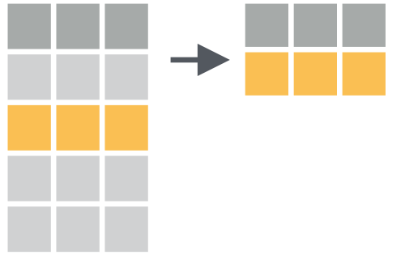
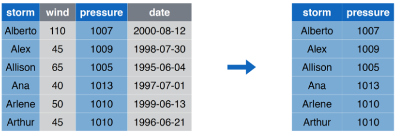
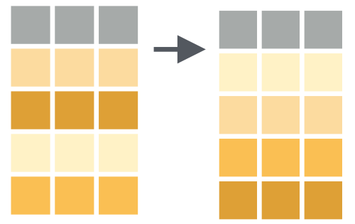
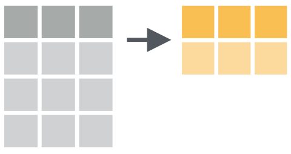
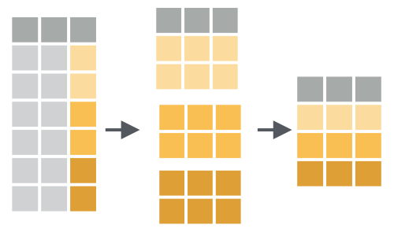
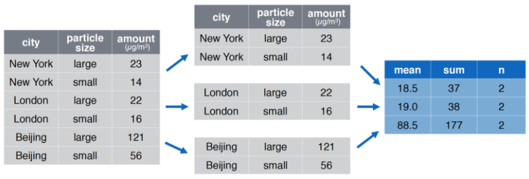

```{r setup, include=FALSE}
source(here::here("slides/xaringan-knitr-setup.R"))
library(flipbookr)

library(dplyr)

storms    <- readr::read_csv(here::here("data/storms.csv"))
pollution <- readr::read_csv(here::here("data/pollution.csv"))
```

class: center, middle

# Programar (y el _pipe_)


---

## Programar

- Programar produce código y el código es una herramienta de comunicación

- El código le dice a la computadora qué es lo que quieres que haga, pero también comunica significado a otros seres humanos

- Es importante pensar el código como un medio de comunicación, ya que todo proyecto que realices es esencialmente colaborativo

- Aun cuando no estés trabajando con otras personas, definitivamente lo estarás haciendo con tu _futuro yo_. 

---

## Formas de programar
  
Revisaremos formas (paradigmas) comunes de escribir código revisando sus beneficios/desventajas:

1. Guardar cada paso intermedio como un nuevo objeto.
1. Sobreescribir el objeto original muchas veces.
1. Componer funciones.
1. Usar pipes.

---

## Ejemplo

Supongamos tenemos un verctor numérico `x` el cual debemos procesar
de la siguiemte manera:

1. Aplicar logartimos al vector numérico `log()`.
1. Obtener la media `mean()` (removiendo los `NA`, cierto?!).
1. Luego aplicar la función exponencial `exp()`.
1. Al final obtener la raíz cuadrada `sqrt()`

<br/>

```{r}
x <- c(2, NA, 4, 6, 7, 8, NA, 10, 15, 2)
x
```

---

`r flipbookr::chunk_reveal("intermedios", title = "## Guardar pasos intermedios")`

```{r intermedios, include = FALSE, echo=FALSE}
x

xlog  <- log(x)
xlog

xmean <- mean(xlog, na.rm = TRUE)
xmean

xexp  <- exp(xmean)
xexp

xsqrt <- sqrt(xexp)
xsqrt
```


---

`r flipbookr::chunk_reveal("sobrescribir", title = "## Sobreescribir el objeto original")`

```{r sobrescribir, include = FALSE, echo=FALSE}
xnew <- x
xnew

xnew <- log(xnew)
xnew

xnew <- mean(xnew, na.rm = TRUE)
xnew

xnew <- exp(xnew)
xnew

xnew <- sqrt(xnew)
xnew
```


---

`r flipbookr::chunk_reveal("componer", title = "## Componer funciones")`

```{r componer, include = FALSE, echo=FALSE}
x

sqrt(
  exp(
    mean(
      log(
        x
        ),
      na.rm = TRUE)
    )
  )

# o
sqrt(exp(mean(log(x), na.rm = TRUE)))
```

---

`r flipbookr::chunk_reveal("usarpipes", title = "## Pipes")`

```{r usarpipes, include = FALSE, echo=FALSE}
x

x |> 
  log() |> 
  mean(na.rm = TRUE) |> 
  exp() |> 
  sqrt()
```

---
  
## Cual es la mejor forma?

1. **Guardar paso intermedio**:
  Se crean objetos irrelevantes con nombres poco importantes. Cuidado al incrementar sufijo en cada linea.
  
--
  
1. **Sobreescribir el objeto original**:
  Depuración (_debuego_) doloroso, si hay un error hay que correr todo desde el comienzo. La repetición `xnew` hace el código poco transparente. 
  
--

1. **Componer funciones**:
  Lectura poco amigable, no tan sencilla de entender. Argumentos terminan separados. _Debugueo_ doloroso. Si existe un error no es sencillo reconocer cual de las funciones ocurrió.
  
--

1. **Pipes**:
  Cuidado al _concatenar_ varios pasos (> 8?). No sirve en caso de tener muchos inputs/outputs, básicamente trabaja un _objeto_. Son lineales, por lo que existe mucho if/else/depependencia compleja más vale separar expresiones.
  

---
  
## El Pipe (_paip_) `|>`

De forma general veremos que `z |> f()` es equivalente a `f(z)` y en el caso 
de aplicar parámetros extras tenemos que `z |> g(y)` es `g(x, y)`.

En el próximo ejemplo veremos que el **pipe** (`|>` o `%>%`) ayuda a la 
legibilidad del código.


---
  
## Diferencias entre `|>` y `%>%`

En el 99% de los códigos estos _pipes_ son intercambiables, i.e., hacen lo mismo.

`%>%`:
- Primero en aparecer a través del paquete `magrittr` (`dplyr`, lo carga).
- Tiene funcionalidades extras, como otros operadores en el paquete `magrittr`.

--

`|>`
- Viene incorporado en R base desde 4.1 (2021-05).


---

class: center, middle

# Transformación de datos


---

## Transformación de datos

> La visualización es una herramienta importante para la generación de conocimiento; sin embargo, es raro que obtengas los datos exactamente en la forma en que los necesitas. A menudo tendrás que crear algunas variables nuevas o resúmenes, o tal vez solo quieras cambiar el nombre de las variables o reordenar las observaciones para facilitar el trabajo con los datos.

Lo anterior es un _copy & paste_ desde [R4DS](https://es.r4ds.hadley.nz/transform.html).

---

## `dplyr` Lo básico

En este capítulo, aprenderás las cinco funciones clave de **dplyr** que te permiten resolver la gran mayoría de tus desafíos de manipulación de datos:

* **Filtrar** o elegir las observaciones por sus valores (`filter()` — del inglés filtrar).
* **Reordenar** las filas (`arrange()` — del inglés organizar).
* **Seleccionar** las variables por sus nombres (`select()` — del inglés seleccionar).
* Crear nuevas variables con **transformaciones** de variables existentes (`mutate()` — del inglés mutar o transformar).
* Contraer muchos valores en un solo **resumen** (`summarise()` — del inglés resumir).

<small>
Todas estas funciones se pueden usar junto con `group_by()` (del inglés _agrupar por_), que cambia el alcance de cada función para que actúe ya no sobre todo el conjunto de datos sino de grupo en grupo.
</small>

---

## `dplyr` Lo básico (2)

Todos los verbos funcionan de manera similar:

1. El **primer** argumento es un *data frame*.

2. Los argumentos posteriores describen qué hacer con el *data frame* usando los nombres de las variables (sin comillas).

3. El **resultado** es un nuevo *data frame*.

En conjunto, estas propiedades hacen que sea fácil encadenar varios pasos simples para lograr un resultado complejo.

---

background-image: url(images/dplyr/dplyr_filter.jpg)
background-size: cover

---

## `filter` Seleccionar Filas

```{r out.width='70%', fig.align='center', echo=FALSE}

```

---

## `filter` Ejemplo

```{r out.width='80%', fig.align='center', echo=FALSE}
knitr::include_graphics("images/dplyr/filter_example.png")
```

---

`r flipbookr::chunk_reveal("filter", title = "## <code>filter</code> Código", widths = c(1, 1))`

```{r filter, include = FALSE}
storms |>
  filter(storm %in% c("Alberto", "Ana"))

# alternativa
storms |>
  filter(storm == "Alberto" | storm == "Ana")
```

---

## `select` Seleccionar Columnas

```{r out.width='70%', fig.align='center', echo=FALSE}
knitr::include_graphics("images/dplyr/select.png")
```

---

## `select` Ejemplo

```{r out.width='80%', fig.align='center', echo=FALSE}

```

---

`r flipbookr::chunk_reveal("select", title = "## <code>select</code> Código", widths = c(1, 1))`

```{r select, include = FALSE}
storms |>
  select(storm, pressure)

# o alternativa, con índices,
# no tan recomendable
storms |>
  select(1, 3)
```

---

## `arrange` Ordenar Filas

```{r out.width='70%', fig.align='center', echo=FALSE}

```

---

## `arrange` Ejemplo

```{r out.width='80%', fig.align='center', echo=FALSE}
knitr::include_graphics("images/dplyr/arrange_example.png")
```

---

`r flipbookr::chunk_reveal("arrange", title = "## <code>arrange</code> Código", widths = c(1, 1))`

```{r arrange, include = FALSE}
storms |>
  arrange(wind)

# multiple columnas con
# orden inverso
storms |>
  arrange(wind, desc(pressure))
```

---

background-image: url(images/dplyr/dplyr_mutate.png)
background-size: contain

---

## `mutate` Crear (o transformar) Columnas

```{r out.width='70%', fig.align='center', echo=FALSE}
knitr::include_graphics("images/dplyr/mutate.png")
```

---

## `mutate` Ejemplo

```{r out.width='80%', fig.align='center', echo=FALSE}
knitr::include_graphics("images/dplyr/mutate_example.png")
```

---

`r flipbookr::chunk_reveal("mutate", title = "## <code>mutate</code> Código", widths = c(1, 2))`

```{r mutate, include = FALSE}
storms |> 
  mutate(
    ratio = pressure/wind,
    inverse = 1/ratio
    )

# o transformar una columna
# ya existente
storms |> 
  mutate(wind = -log(wind))
```

---

`r flipbookr::chunk_reveal("mutate2", title = "## <code>mutate</code> Código (dato)", widths = c(1, 2))`

```{r mutate2, include = FALSE}
storms |> 
  mutate(
    wind_promedio = mean(wind)
    ) |> 
  filter(wind > wind_promedio)
```


---

## `summarise` Resumir Columnas

```{r out.width='70%', fig.align='center', echo=FALSE}

```

---

## `summarise` Ejemplo

```{r out.width='80%', fig.align='center', echo=FALSE}
knitr::include_graphics("images/dplyr/summarise_example.png")
```

---

`r flipbookr::chunk_reveal("summarise", title = "## <code>summarise</code> Código", widths = c(1, 1))`

```{r summarise, include = FALSE}
pollution |>
  summarise(median = median(amount))
```

---


## `group_by |> summarise` Resumir Columnas por Grupos

```{r out.width='70%', fig.align='center', echo=FALSE}

```

---

## `group_by |> summarise` Ejemplo

```{r out.width='80%', fig.align='center', echo=FALSE}

```

---

`r flipbookr::chunk_reveal("group_by", title = "## <code>group_by |> summarise</code> Código", widths = c(1, 1))`

```{r group_by, include = FALSE}
pollution |> 
  group_by(city) |>
  summarise(
    mean = mean(amount),
    sum = sum(amount),
    n = n()
  )
```


---

`r flipbookr::chunk_reveal("group_by_spanish", title = "## <code>group_by |> summarise</code> Código <small>(spanish version)</small>", widths = c(1, 1))`

```{r group_by_spanish, include = FALSE}
pollution |> 
  group_by(city) |>
  summarise(
    promedio = mean(amount),
    suma = sum(amount),
    conteo = n()
  )
```

---

`r flipbookr::chunk_reveal("group_by_mutate", title = "## <code>group_by |> mutate</code> Código <small>(spanish version)</small>", widths = c(1, 1))`

```{r group_by_mutate, include = FALSE}
pollution |> 
  # no es necesario pero sirve para viz
  arrange(size) |> 
  group_by(size) |> 
  mutate(promedio_amout = mean(amount)) |> 
  filter(amount > promedio_amout)
```


---


## Ejercicio: en un script de R:

<small>

1. Cargue el paquete `tidyverse`, y cree un data frame con columnas `x` e `y`, cada una de las columnas
sea 1000 números aleatorios entre -1 y 1 (recuerde la función `runif`).
1. Genere un gráfico de puntos visualizando como se relacionan las variables `x` e `y`.
1. Con la función `mutate` cree una variable  `r` que sea igual a `x^2 + y^2`, es decir $x^2 + y^2$.
1. Utilize la función `if_else` (y `mutate`) para generar una cuarta variable cuya definición es: si `r` es mayor que 1 entonces vale "A", en caso contrario "B". Llame esta variable como `r2`.
1. Ahora vuelva generar el gráfico de 3. pero coloreando el punto de acuerdo a la variable `r2`.
1. Utilice el _combo_ `group_by(r2) |> count()` para contar cuantos son "A" y "B", y luego generar la columna `p = n/sum(n)`. 
1. Cree la columna `es_b` que indique con un 1 si el valor de `r2` es "B" y 0 si es "A", para luego
crear la columna `convergencia` al aplicar la función `cummean` a la columna `es_b`.
1. con ayuda de la función `row_number()` genere la columna `fila` y haga un gráfico de líneas 
con `x = fila` e `y = 4 * convergencia`.
</small>


---


`r flipbookr::chunk_reveal("solucion", title = "## Posible solución", widths = c(1, 1))`

```{r solucion, include = FALSE}
library(tidyverse)

set.seed(123)

df <- tibble(
  x = runif(1000, -1, 1),
  y = runif(1000, -1, 1)
)

df |> 
  mutate(r = x^2 + y^2) |> 
  mutate(r2 = if_else(r > 1, "A", "B")) |> 
  mutate(es_b = if_else(r2 == "B", 1, 0)) |> 
  mutate(convergencia = cummean(es_b)) |> 
  mutate(fila = row_number()) 
```

---

`r flipbookr::chunk_reveal("solucion2", title = "## Posible solución v2", widths = c(1, 1), chunk_options = "fig.height = 2.7, fig.width = 3")`

```{r solucion2, include = FALSE}
library(tidyverse)

set.seed(123)

df <- tibble(
  x = runif(10000, -1, 1),
  y = runif(10000, -1, 1)
)

df |> 
  mutate(
    r = x^2 + y^2,
    ri = r < 1,
    convergencia = cummean(ri),
    row = row_number()
    ) |> 
  ggplot() +
  geom_line(aes(row, 4 * convergencia)) +
  geom_hline(yintercept = pi, color = "darkred")  +
  scale_x_continuous(labels = scales::comma_format()) +
  scale_y_continuous(
    sec.axis = sec_axis(trans = ~., breaks = pi, labels = expression(pi))
  )
```

---

## Ejercicio en grupo! Un solo grupo!

1. Cargue **tidyverse** y el paquete **datos**. Explore las tablas `vuelos`, `aeropuertos`, `aerolineas`, `clima` y `aviones`. 
1. Filtra los vuelos que han sido cancelados.
1. Filtra los vuelos que salieron del aeropuerto JFK.
1. Encuentra el número de vuelos que llegaron tarde más de 2 horas.
1. Agrupa los vuelos por mes y encuentra el número promedio de pasajeros por mes.
1. Encuentra el día de la semana con la mayor cantidad de vuelos.
1. Encuentra el aeropuerto de destino más popular.

---

## Ejercicio en grupo! Un solo grupo! (cont.)

1. Encuentra el promedio de la duración del vuelo (en minutos) para los vuelos que salieron del aeropuerto JFK y llegaron al aeropuerto LAX.
1. Obtenga el par `origen` `destino` más común.
1. Encuentra el número promedio de vuelos por día para cada aerolínea.
1. Cuál es el vuelo de mayor duración.
1. Cual es la arolínea que presenta mayor proporción de atrasos (salida/llegada),
1. Por mes, obtenga el promedio/mediana de atrasos (salida/llegada), y grafique en ggplot2 a modo de explicar los observado.
1. Realice un gráfico de `fecha` por temperatura separando por origen (aeropuerto de salida).


---

## Otro tipo de ejercicios

Con el data frame `vuelos`:

1. Selecciona todas las variables numéricas para luego obtener para cada una de ellas el promedio y la mediana.
1. Selecciona las columnas que tienen al menos un `NA`, para luego quedarse con las filas que presentan algún `NA` en ellas, y luego seleccionar todas las filas que poseen todos sus columnas `NA`s.

---

`r flipbookr::chunk_reveal("otrotipo1", title = "## Otro tipo de ejercicios (1)", widths = c(1, 1))`

```{r otrotipo1, include = FALSE}
library(tidyverse)
library(datos)

vuelos |> 
  select(where(is.numeric)) |> 
  summarise(
    across(
      everything(), 
      list(
        promedio = ~ mean(.x, na.rm = TRUE),
        mediana  = ~ median(.x, na.rm = TRUE)
        )
      )
    ) |> 
  glimpse()
```


---

`r flipbookr::chunk_reveal("otrotipo2", title = "## Otro tipo de ejercicios (2)", widths = c(1, 1))`

```{r otrotipo2, include = FALSE}
library(tidyverse)
library(datos)

algun_na <- function(x) any(is.na(x))

x <- c(0, NA, 0)
is.na(x)
algun_na(x)

vuelos |> 
  select(where(algun_na)) |>
  filter(if_any(everything(), is.na)) |> 
  filter(if_all(everything(),  is.na)) |> 
  glimpse()
```

---

## `dplyr` Lo menos básico

`dplyr` ofrece todo un grupo de helpers para realizar el análsis más textual (verbose). Se recomienda buscar:

- `contains`, `start_with`
- `across`, `where`
- `if_any`, `if_all`

---

## Más información sobre transformación de datos

- Capítulo [Pipes](https://es.r4ds.hadley.nz/pipes.html) en R4DS.

- Ejercicio de [Transformación de datos](https://es.r4ds.hadley.nz/transform.html) en R4DS.

- [Tidy data tutor](https://tidydatatutor.com/vis.html), visualizar _pipelines_ de 
transformación de datos.

 


