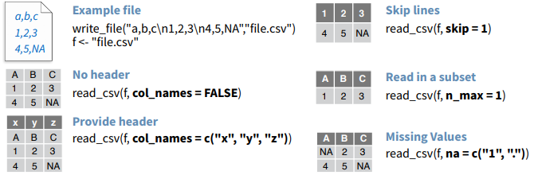

```{r setup, include=FALSE}
source(here::here("slides/xaringan-knitr-setup.R"))
```

## Orígenes de información

Los datos puden venir de muchas fuentes distintas:
--


- Archivo de texto: csv, txt, tsv, fwf.
--

- Planillas, archivos excel.
--

- SPSS (?) SAS (?!) STATA (?!?!?).
--

- Bases de Datos. Esto es todo un mundo, existen muchos motores de bases de datos.
--

- Desde una página web: https://www.reclamos.cl/empresa/uber-eats
--

- Una API: https://climatologia.meteochile.gob.cl/application/productos/datosRecientesEma/330020/2022/05
--

- Algo más?
  
---
  
## `paquete::funcion` para cada tipo de origen

Origen            | `paquete::funcion`
------------------|---------
`xlsx`            |  `readxl::read_excel`
`txt`             |  `readr::read_delim` / `data.table::fread`
`csv`             |  `readr::read_csv` / `data.table::fread`
Bases de datos    |  Paquete `dbplyr`
API               |  `httr::GET`
Página web        |  `rvest::read_html`
Archivo SPSS`sav` |  `haven::read_sav` / `haven::read_spss`
Archivo SAS       |  `haven::read_sas`
Archivo STATA     |  `haven::read_stata`

<small>
En general Bases de datos es más general dado que existen distintos motores de bases
de datos. Más info en [dbplyr](https://dbplyr.tidyverse.org/articles/dbplyr.html).
</small>

---

## `read_csv` / `read_delim`

```{r out.width='70%', fig.align='center', echo=FALSE}
knitr::include_graphics("images/readr/readr.png")
```

---

## `read_csv` / `read_delim` parámetros

<br/>

```{r out.width='70%', fig.align='center', echo=FALSE}

```


---

`r flipbookr::chunk_reveal("read_excel", title = "## <code>readxl::read_excel</code>", widths = c(1, 1))`

```{r read_excel, include = FALSE}
library(readxl)

ruta <- here::here("data/muestrame_los_numeros.xlsx")
ruta

read_excel(ruta)
```

---

`r flipbookr::chunk_reveal("read_csv", title = "## <code>readr::read_csv</code>", widths = c(1, 1))`

```{r read_csv, include = FALSE}
library(readr)

ruta <- here::here("data/pollution.csv")
ruta

read_csv(ruta)
```

---

`r flipbookr::chunk_reveal("GET", title = "## <code>httr::GET</code>", widths = c(1, 1), chunk_options = "fig.height = 2.7, fig.width = 3")`

```{r GET, include = FALSE}
library(httr)
library(tidyverse) # dplyr + ggplot + etc

url <- "https://mindicador.cl/api/tasa_desempleo/"

content(httr::GET(url)) |> 
  pluck("serie") |> 
  purrr::map_df(tibble::as_tibble) |>
  mutate(fecha = ymd_hms(fecha)) |> 
  ggplot(aes(fecha, valor)) +
  geom_line(size = 1.2, color = "steelblue") +
  ylim(c(0, NA)) +
  labs(title = "Tasa de desempleo")
```

---

`r flipbookr::chunk_reveal("dbplyr", title = "## Bases de datos <code>dbplyr</code>", widths = c(1, 1))`

```{r dbplyr, include = FALSE}
library(dplyr)
library(dbplyr)
library(DBI)
library(RMariaDB)

# https://docs.rfam.org/en/latest/database.html
con <-  dbConnect(
  RMariaDB::MariaDB(),
  host = "mysql-rfam-public.ebi.ac.uk",
  db = "Rfam", 
  user = "rfamro",
  port = 4497
  )

tbl(con, "taxonomy") |> 
  select(ncbi_id, species, tax_string) |> 
  filter(ncbi_id == 10116) |> 
  show_query() |> 
  collect()
```


---

`r flipbookr::chunk_reveal("dbplyr_cont", title = "## Bases de datos (cont.) <code>dbplyr</code>", widths = c(1, 1))`

```{r dbplyr_cont, include = FALSE}
con

DBI::dbListTables(con)


```

---

`r flipbookr::chunk_reveal("rvest", title = "## HTML <code>rvest::read_html</code>", widths = c(1, 1), chunk_options = "fig.height = 2.7, fig.width = 3")`


```{r rvest, include=FALSE}
library(rvest)
library(lubridate)

url <- "https://www.reclamos.cl/empresa/pontificia_universidad_catolica"

read_html(url) |> 
  html_table() |> 
  first() |> 
  set_names(c("fecha", "reclamo", "cantidad")) |> 
  mutate(fecha = dmy(fecha)) |> 
  arrange(fecha, cantidad) |> 
  ggplot(aes(fecha, cantidad)) +
  geom_line(color = "gray80", size = 1.2) +
  geom_smooth(alpha = 0.25, size = 1.2) +
  coord_cartesian(ylim = c(0, NA)) +
  theme_minimal()
```

---

`r flipbookr::chunk_reveal("rvestv2", title = "## HTML v2 <code>rvest::read_html</code>", widths = c(1, 1), chunk_options = "fig.height = 2.7, fig.width = 3")`

```{r rvestv2, include=FALSE}
library(httr)
library(tidyverse) # dplyr + ggplot + etc
library(chilemapas) # gracias Pachá!
url <- "https://www.sismologia.cl/sismicidad/catalogo/2023/04/20230419.html"

read_html(url) |> 
  html_table() |> 
  nth(2) |> 
  mutate(across(everything(), readr::parse_guess)) |>
  mutate(Magnitud = as.numeric(stringr::str_remove(`Magnitud (2)`, "Ml"))) |>
  separate(`Latitud / Longitud`, c("lat", "lon"), sep = " ", convert = TRUE) |> 
  ggplot() +
  geom_sf(
    data = chilemapas::mapa_comunas, aes(geometry = geometry),
    fill = "gray70", color = "white", alpha = 0.5, size = 0.3
    ) +
  geom_point(aes(x = lon, y = lat, size = Magnitud),
    shape = 21, fill = "gray60", color = "gray40",) +
  coord_sf(xlim = c(-80, NA)) +
  theme_void()
```

---

## Ejercicio BBDD

Revise https://relational.fit.cvut.cz/dataset/Employee.

1. Realice la conexión `con` a la bbdd.
1. Obtenga el salario promedio por título y genero. 
1. Utilice el comando `show_query` para explorar la consulta.
1. Grafique de alguna forma adecuada los datos obtenidos.

---

## Ejercicio archivos de texto

Lea un archivo de texto utilizando alguna función del paquete `readr` y 
con la funcion `data.table::fread`. Que obtiene con dada una? Existen Diferencas?


---

## Más información sobre transformación de datos


- 

- Paquete [dbplyr](https://dbplyr.tidyverse.org/articles/dbplyr.html).


