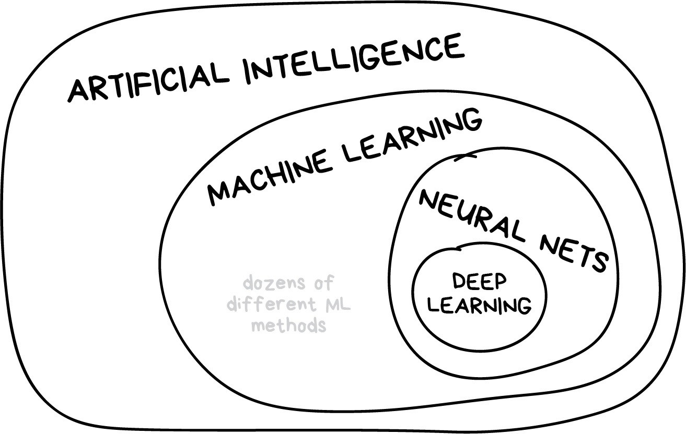
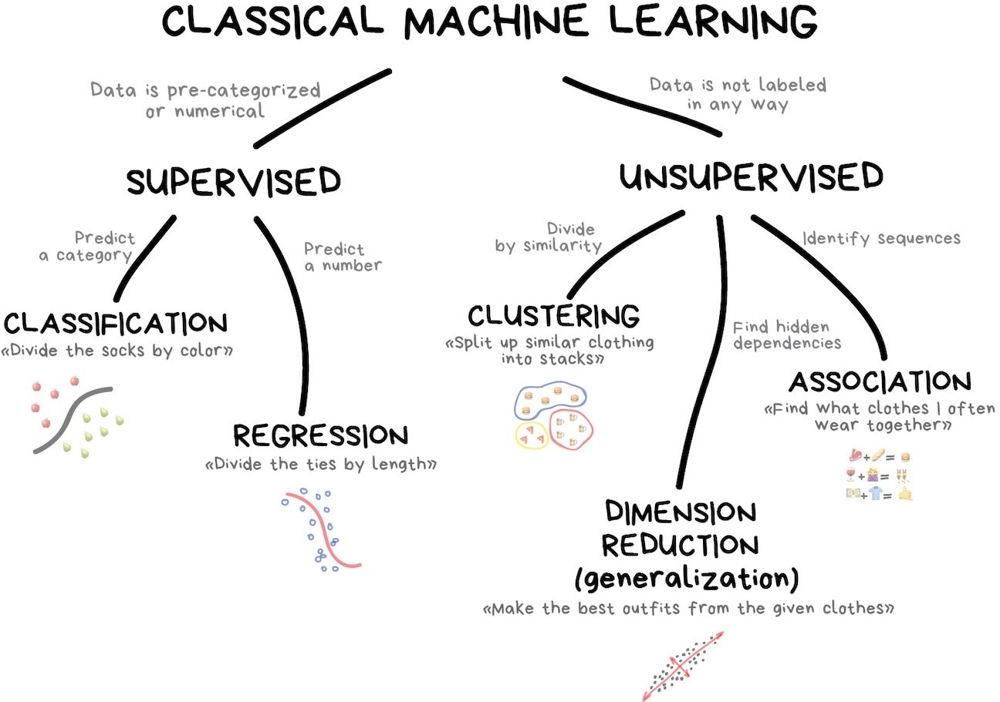

```{r setup, include=FALSE}
source(here::here("slides/xaringan-knitr-setup.R"))

library(patchwork)
# remotes::install_github("grantmcdermott/parttree")
library(parttree) # geom_parttree
library(ggparty)
library(showtext)
font_add_google("Alegreya Sans SC")
```

class: center, inverse, middle

# Árboles de Decisión

---

## Antes de empezar

En caso de querer profundizar modelamiento predictivo, un buen material es _Tidy modelling with R_ https://www.tmwr.org/, 
nos servirá como guía en nuestro programa.

- Como introducción utilizaremos el blogpost [Machine Learning for Everyone](https://vas3k.com/blog/machine_learning/).

---

## Inteligencia artificial

La inteligencia artificial es, en ciencias de la computación, la disciplina que intenta replicar y desarrollar la inteligencia y sus procesos implícitos a través de computadoras.

```{r out.width="60%", fig.align='center', echo=FALSE}

```

---

## Inteligencia artificial (cont.)


Diferencia con el machine learning:

De https://azure.microsoft.com/en-in/solutions/ai/artificial-intelligence-vs-machine-learning/#introduction:

Una computadora "inteligente" usa IA para pensar como un humano y realizar tareas por sí misma. El aprendizaje automático es cómo un sistema informático desarrolla su inteligencia.

---

## Machine learning

El aprendizaje de máquinas es una rama de la inteligencia artificial, cuyo objetivo es desarrollar técnicas que permitan que las computadoras _aprendan_.

```{r out.width="55%", fig.align='center', echo=FALSE}

```

---

## Clasificación

https://vas3k.com/blog/machine_learning/#scroll70.

Separar objetos basado en atributos conocidos de antemano. Usado para:

* Filtro Spam.
* Detección de Lenguaje.
* Detección de fraude.
* Venta de productos financieros.

Algoritmos populares: Arbol de decisión, Regresión logística, 
Naive Bayes, KNN (K-Nearest Neighbours).


---

## Naive Bayes

```{r out.width="70%", fig.align='center', echo=FALSE}
knitr::include_graphics("images/naive-bayes.jpg")
```

<small>Suponga que se tienen 1.000 _good_ y 1.000 _spam_. Calcule probabilidad
de que sea Spam dado que contiene la palabra Kitty.</small>


---

## Naive Bayes (cont.)

Suponga que se tienen 1.000 _good_ y 1.000 _spam_. Calcule probabilidad
de que sea Spam dado que contiene la palabra Kitty.

$$\begin{aligned} 
 \Pr(Spam|Kitty) &= \frac{\Pr(Kitty|Spam) \Pr(Spam)}{\Pr(Kitty)} \\ 
                 &= \frac{ \frac{13}{1000} \times \frac{1000}{1000+1000}}{\frac{672 + 13}{1000+1000}}   \\
                 &= 0.0189781
\end{aligned}$$

--

* ¿Qué características observamos en este método?
* ¿Qué ocurre si tenemos más variables, como por ejemplo la hora del email, 
dominio del correo? Ver siguiente [link](https://leasetruk.medium.com/naive-bayes-classifier-with-examples-7b541f9ffedf).

---

## Árbol de Decisión (Decision tree)

```{r out.width="70%", fig.align='center', echo=FALSE}
knitr::include_graphics("images/decision-tree.jpg")
```

Revisar [Una introducción visual al machine learning](http://www.r2d3.us/visual-intro-to-machine-learning-part-1/)!.


---

`r flipbookr::chunk_reveal("arbol", title = "## Árbol de Decisión en R", widths = c(1, 1), chunk_options = "fig.height = 2.7, fig.width = 3")`

```{r arbol, include = FALSE}
set.seed(123)
library(tidyverse) 
library(partykit) 

ruta <- "https://raw.githubusercontent.com/jadeyee/r2d3-part-1-data/master/part_1_data.csv"

datos <- readr::read_csv(ruta, skip = 2)

datos <- datos |> 
  mutate(in_sf = factor(ifelse(in_sf == 1, "SF", "NY")))

arbol <- ctree(in_sf ~ ., data = datos)

arbol
```

---

## Árbol de Decisión en R (cont.) `plot()`

```{r, echo=FALSE}
plot(arbol, gp = gpar(fontsize = 8))
```

---

## Árbol de Decisión en R (cont.)

```{r, echo=FALSE}
ggparty(arbol) +
  geom_edge(color = "gray75") +
  geom_edge_label(color = "gray25", size = 3) +
  # geom_node_splitvar()
  geom_node_label(
    aes(label = splitvar), ids = "inner",
    # fill = "white",
    color = "gray20",
    label.col = NA, # remueve caja
    size = 4,
    label.padding = unit(0.5, "lines")
  ) +
  geom_node_plot(
    gglist = list(
      geom_bar(aes(x = "", fill = in_sf), position = position_fill()),
      scale_fill_viridis_d(begin = 0.2, end = 0.8),
      coord_polar("y"),
      theme_void()
      ),
    size = "nodesize"
    )
```


---

## Árbol de Decisión en R (cont.)

```{r, echo=FALSE}
ggparty(arbol) +
  geom_edge(color = "gray75") +
  geom_edge_label(color = "gray25", size = 3) +
  # geom_node_splitvar()
  geom_node_plot(
    ids = "all",
    gglist = list(
      geom_bar(aes(x = "", fill = in_sf), position = position_fill()),
      scale_fill_viridis_d(begin = 0.2, end = 0.8),
      coord_polar("y"),
      theme_void()
      ),
    size = "nodesize"
    ) +
    geom_node_label(
    # nudge_y = 0.08,
    aes(label = splitvar), 
    ids = "inner",
    fill = "#F0F0F050",
    color = "gray20",
    label.col = NA, # remueve caja
    size = 4,
    label.padding = unit(0.5, "lines")
  )
```

---

## Partes del Árbol de Decisión

Las partes del árbol son:

1. Nodo: Que refleja que **variable** se utiliza para evaluar la condición.
1. Rama: Se define en base a la **región** de la variable especificada en el nodo previo.
1. Hoja o Nodo terminal: Especifica el **resultado** de la variable respuesta.

Links:
- https://cran.r-project.org/web/packages/partykit/
- https://cran.r-project.org/web/packages/ggparty/
- http://grantmcdermott.com/parttree/index.html


---

## Parámetros para generar un Árbol de Decisión

Si bien existen varias formas/métodos/algoritmos de crear árboles (siguiente slides) los
parámetros usuales son.

1. Profundidad del árbol.
1. Cantidad (o proporción) mínima de observaciones en nodo terminal.
1. Tipo de test para seleccionar la variable en un nodo.
1. Tipo de test para seleccionar el punto para la división del nodo.
1. _Confianza_ con que se genera un split/nodo.

---

## Tipos de Árbol de Decisión

Existen muchos tipos de algoritmos de árboles. Básicamente se diferencian en:

* La forma de seleccionar cual es la variable
que mejor separa los subconjuntos (etiquetas/variable respuesta) y,
* Como se obtiene el límite de dicha variable.


Algoritmos conocidos son CART, CHAID, [C4.5](https://en.wikipedia.org/wiki/C4.5_algorithm),
C5.0, Conditional Inference Trees.

---

## Otra forma de visualizar

```{r, echo=FALSE}
viz_tree_depth <- function(depth = 0){
  
  datos <- datos |> 
    mutate(elevation_sqrt = round(sqrt(elevation), 2))
  
  arbol <- ctree(
    in_sf ~ elevation_sqrt + price_per_sqft,
    data = datos, 
    control = ctree_control(maxdepth = depth)
    )
  
  arbol
  
  if(depth == 0){
    
    p1 <- ggplot(datos) +
      geom_point(aes(elevation_sqrt, price_per_sqft, color = in_sf)) +
      scale_color_viridis_d(begin = 0.2, end = 0.8) 
    
    # Basic piechart
    p2 <- datos |> 
      count(in_sf) |> 
      ggplot() +
      geom_col(aes(x = "", y = in_sf, fill = in_sf)) +
      scale_fill_viridis_d(begin = 0.2, end = 0.8) +
      coord_polar("y", start=0) +
      theme_void() + # remove background, grid, numeric labels
      theme(legend.position = "bottom")
  
    return(
      p1 + p2 +
        plot_layout(widths = c(1, 1))
    )
    
  } 
  
  p1 <- ggplot(datos) +
    geom_point(aes(elevation_sqrt, price_per_sqft, color = in_sf)) +
    geom_parttree(
      data = arbol, 
      color = "gray50",
      linewidth = 1,
      aes(fill = in_sf), alpha = 0.1
      ) + 
    scale_color_viridis_d(begin = 0.2, end = 0.8) +
    scale_fill_viridis_d(begin = 0.2, end = 0.8) 

  p1
  
  
  
  p2 <- ggparty(arbol) +
    geom_edge(color = "gray75") +
    geom_edge_label(color = "gray25", size = 3) +
    # geom_node_splitvar()
    geom_node_label(
      aes(label = splitvar),
      ids = "inner",
      # fill = "white",
      color = "gray20",
      label.col = NA,
      # remueve caja
      size = 4,
      label.padding = unit(0.5, "lines")
    ) +
    geom_node_plot(
      gglist = list(
        geom_bar(aes(x = "", fill = in_sf), position = position_fill()),
        scale_fill_viridis_d(begin = 0.2, end = 0.8),
        coord_polar("y"),
        theme_void()
      ),
      size = "nodesize"
    )
  
  p1 + p2
  
}

viz_tree_depth(depth = 0)
```

---

## Otra forma de visualizar (cont.)

```{r, echo=FALSE}
viz_tree_depth(depth = 1)
```

---

## Otra forma de visualizar (cont.)

```{r, echo=FALSE}
viz_tree_depth(depth = 2)
```

---

## Otra forma de visualizar (cont.)

```{r, echo=FALSE}
viz_tree_depth(depth = 3)
```

---

## Otra forma de visualizar (cont.)

```{r, echo=FALSE}
viz_tree_depth(depth = 4)
```

---

## Otra forma de visualizar (cont.)

```{r, echo=FALSE}
viz_tree_depth(depth = 5)
```

---

class: center, inverse, middle

# Métricas de Evaluación 

---

## Recordar Métricas de Evaluación en caso de Regresión...

En el caso de regresión, las metricas se basan en resumir (promedio, mediana, etc)
los errores de predicción: $e_i = real_i - pred_i$.

<br/>

$$\text{Mean squared error: MSE} = {mean(e^2_i)} = {\sum{e^2_i/n}} $$

$$\text{Root mean squared error: RMSE} = \sqrt{mean(e^2_i)} = \sqrt{\sum{e^2_i/n}} $$

$$\text{Mean absolute percentage error: MAPE} = mean(|p_i|) = \sqrt{\sum{|p_i|/n}} = \sqrt{\sum{|(e_i/y_i)|/n}}$$


---

`r flipbookr::chunk_reveal("arbol2", title = "## Volviendo al caso clasificación", widths = c(1, 1), chunk_options = "fig.height = 2.7, fig.width = 3")`

```{r arbol2, include = FALSE}
set.seed(123)
datanueva <- sample_n(datos, 5)

datanueva$in_sf

predict(arbol, newdata = datanueva)

predict(arbol, newdata = datanueva,
        type = "prob")

predict(arbol, newdata = datanueva,
        type = "prob")[, 2]

predict(arbol, newdata = datanueva,
        type = "node")
```

---

##  Métricas de Evaluación caso Clasificación

Existen varias métricas. Podemos agrupar segun si el modelo está predicciendo **categorías** o **probabilidad** de pertenecer a una categoría en particular.

--

En el caso de categorías, con ayuda de la matriz de confusión (siguiente slide) podremos obtener medidas como: Accuracy, Precision, Recall/sensitividad, especificidad.

--

Para un modelo que proporciona probabilidades se utiliza curva ROC, estadístico Kolmogorov-Smirnov, Log-loss.

Dado un punto de corte , límite o _threshold_ podemos categorízar nuestra probabilidad y utilizar las medidas
para el caso de categorias.


---

## Metricas de Evaluación caso Clasificación: categorías

Matriz de confusión:

```{r, echo=FALSE, results='asis'}
table <- "
|            |          | **Predicted**|          |
|:----------:|----------|:------------:|:--------:|
|            |          |  Positive    | Negative |
| **Actual** | Positive |     TP       |  FN      |
|            | Negative |     FP       |  TN      |"
cat(table)
```


---

## Metricas de Evaluación caso Clasificación: categorías

Matriz de confusión:

```{r, echo=FALSE, results='asis'}
cat(table)
```

<br>

$$Accuracy = \frac{TP + TN}{TP + TN + FP + FN}$$

--

Es el más simple de entender pero con varias limitantes.

---

## Metricas de Evaluación caso Clasificación: categorías

Matriz de confusión:

```{r, echo=FALSE, results='asis'}
cat(table)
```

<br>

$$Precision = \frac{TP}{TP + FP} \hspace{2cm} Recall = \frac{TP}{TP + FN}$$

--

La $Precision$ nos proporciona información sobre el rendimiento de capturar a los positivos, cuanta seguridad se tiene cuando se predice _positivo_. Mientras que que $Recall$ o $sensitivity$ mide cuanto de los _reales positivos_ son bien predichos por el modelo.


---

## Metricas de Evaluación caso Clasificación: categorías

Revisar ejemplo interactivo en https://mlu-explain.github.io/precision-recall/.

Buen resumen tiene wikipedia https://en.wikipedia.org/wiki/Confusion_matrix, https://en.wikipedia.org/wiki/Precision_and_recall

https://www.iartificial.net/precision-recall-f1-accuracy-en-clasificacion/

---

## Metricas de Evaluación caso Clasificación: probabilidad

Bien conocido es el área bajo la curva ROC el cual da una visión global de la relación
entre recall/senitividad y la especificidad considerando todos los threshold posibles.

Revisar:

- https://mlu-explain.github.io/roc-auc/
- http://mfviz.com/binary-predictions/
- http://www.navan.name/roc/


--

Estadístico Kolmogorov-Smirnov $KS$ mide la separación de las distribuciones de probabilidad 
de los positivos y negativos (siguiente slide).

De forma técnica se define como la máxima separación de las distribuciones acumuladas.

---

## Metricas de Evaluación caso Clasificación: probabilidad

```{r echo=FALSE}
plot_ks <- function(d = 1, n = 100){
  
  neg <- rnorm(n = n, mean = 0)
  pos <- rnorm(n = n, mean = d)
  
  df <- tibble(
    class = rep(c("neg", "pos"), each = n),
    prob  = c(neg, pos)
  )
  
  df <- df |>
    mutate(prob = scales::rescale(prob, to = c(0, 1))) |> 
    arrange(class, prob) |> 
    group_by(class) |> 
    mutate(
      pcum = ecdf(prob)(prob)
    )
  
  ks <- risk3r:::ks(
    actual = as.numeric(as.factor(df$class)) -1,
    predicted = df$prob
    )
  
  p1 <- ggplot(df) +
    geom_density(aes(prob, fill = class), alpha = 0.5) +
    scale_fill_manual(values = c(scales::muted("red"), scales::muted("blue"))) +
    labs(title = str_glue("KS {scales::percent(ks)}"))
  
  p2 <- ggplot(df) +
    geom_line(aes(prob, pcum, color = class), alpha = 0.8, linewidth = 2) +
    scale_color_manual(values = c(scales::muted("red"), scales::muted("blue")))
    
  p1/p2 &
    labs(x = NULL, y = NULL) &
    theme(legend.position = "none") 
  
}

plot_ks(0) |  plot_ks(1) | plot_ks(1.5)
```

---

## Ejercicio 1

- Separe los datos `datos_credito` en muestra de desarrollo y validación.

- Realice algunas exploraciones visuales.

- Ajuste un árbol con el paquete `partykit` de profundidad 5 y explore el modelo.

- Calcule las métricas para evaluar el modelo en la muestra de desarrollo y validación.

- Pruebe lo anterior con distintos valores de `maxdepth`.

---

class: center, inverse, middle

# Random Forest


---

## Random Forest


En Random Forest, se crea un conjunto de árboles de decisión, donde cada árbol se entrena con:

1. Una muestra aleatoria del conjunto de datos de entrenamiento (parámetro `ntree` o similar). 
2. En cada nodo de división de un árbol, se considera solo un subconjunto aleatorio de características para tomar la decisión (parámetro `mtry`).

--

Cuando se realiza una predicción con Random Forest, cada árbol del conjunto emite una predicción y la clase final se determina por votación o promediando las predicciones.

--

Random Forest tiene varias ventajas: (1) Como su capacidad para manejar conjuntos de datos grandes, (2) lidiar con características faltantes y seleccionar características importantes, (3) es menos propenso al sobreajuste en comparación con un solo árbol de decisión. (n) etc!

https://mlu-explain.github.io/random-forest/


---

## Ejercicio 2

- Con los mismos datos del ejericio 1.

- Ajuste un random Forest con el paquete `ranger`.

- Calcule las métricas para evaluar el modelo en la muestra de desarrollo y validación.

---

## Más información

- [Tidy Modeling with R](https://www.tmwr.org/).
- [Machine Learning for Everyone](https://vas3k.com/blog/machine_learning/).
- [Machine Learning University](https://mlu-explain.github.io/).


