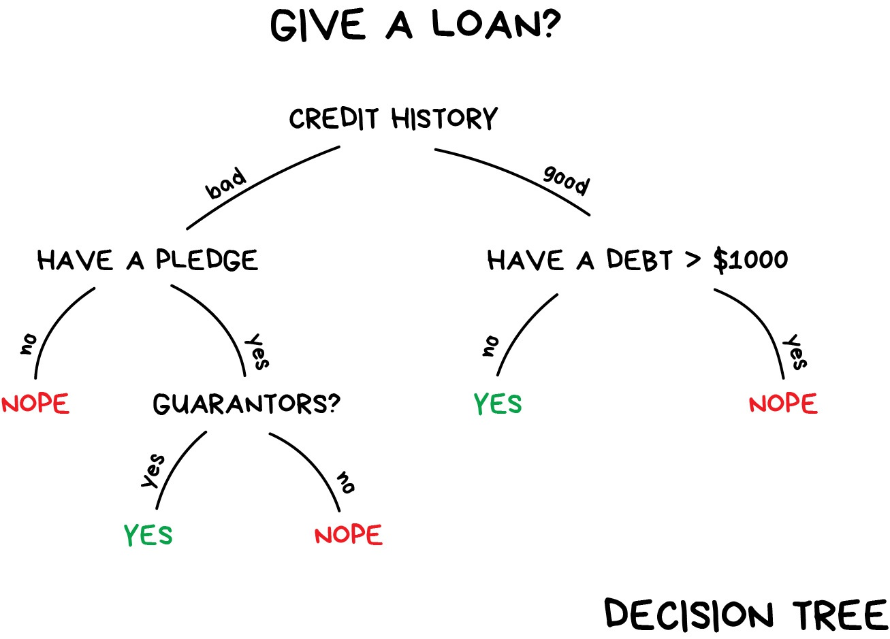

```{r setup, include=FALSE}
source(here::here("slides/xaringan-knitr-setup.R"))

library(patchwork)
# remotes::install_github("grantmcdermott/parttree")
library(parttree) # geom_parttree
library(ggparty)
library(showtext)
font_add_google("Alegreya Sans SC")
```

## Antes de empezar

- Repositorio del curso https://github.com/jbkunst/intro-machine-learning 
encontraremos el programa, clases, datos.

- La bibliografía principal será _Tidy modelling with R_ https://www.tmwr.org/, 
nos servirá como guía en nuestro programa.

- Como introducción utilizaremos el blogpost [Machine Learning for Everyone](https://vas3k.com/blog/machine_learning/).

---

## Inteligencia artificial

La inteligencia artificial es, en ciencias de la computación, la disciplina que intenta replicar y desarrollar la inteligencia y sus procesos implícitos a través de computadoras.

```{r out.width="60%", fig.align='center', echo=FALSE}

```

---

## Inteligencia artificial (cont.)


Diferencia con el machine learning:

De https://azure.microsoft.com/en-in/solutions/ai/artificial-intelligence-vs-machine-learning/#introduction:

Una computadora "inteligente" usa IA para pensar como un humano y realizar tareas por sí misma. El aprendizaje automático es cómo un sistema informático desarrolla su inteligencia.

---

## Machine learning

El aprendizaje de máquinas es una rama de la inteligencia artificial, cuyo objetivo es desarrollar técnicas que permitan que las computadoras _aprendan_.

```{r out.width="55%", fig.align='center', echo=FALSE}
knitr::include_graphics("images/machine-learning-map.jpg")
```

---

## Clasificación

https://vas3k.com/blog/machine_learning/#scroll70.

Separar objetos basado en atributos conocidos de antemano. Usado para:

* Filtro Spam.
* Detección de Lenguaje.
* Detección de fraude.
* Venta de productos financieros.

Algoritmos populares: Arbol de decisión, Regresión logística, 
Naive Bayes, KNN (K-Nearest Neighbours).


---

## Naive Bayes

```{r out.width="70%", fig.align='center', echo=FALSE}
knitr::include_graphics("images/naive-bayes.jpg")
```

<small>Suponga que se tienen 1.000 _good_ y 1.000 _spam_. Calcule probabilidad
de que sea Spam dado que contiene la palabra Kitty.</small>


---

## Naive Bayes (cont.)

Suponga que se tienen 1.000 _good_ y 1.000 _spam_. Calcule probabilidad
de que sea Spam dado que contiene la palabra Kitty.

$$\begin{aligned} 
 \Pr(Spam|Kitty) &= \frac{\Pr(Kitty|Spam) \Pr(Spam)}{\Pr(Kitty)} \\ 
                 &= \frac{ \frac{13}{1000} \times \frac{1000}{1000+1000}}{\frac{672 + 13}{1000+1000}}   \\
                 &= 0.0189781
\end{aligned}$$

--

* ¿Qué características observamos en este método?
* ¿Qué ocurre si tenemos más variables, como por ejemplo la hora del email, 
dominio del correo? Ver siguiente [link](https://leasetruk.medium.com/naive-bayes-classifier-with-examples-7b541f9ffedf).

---

## Árbol de Decisión (Decision tree)

[Una introducción visual al machine learning](http://www.r2d3.us/visual-intro-to-machine-learning-part-1/).

```{r out.width="70%", fig.align='center', echo=FALSE}

```


---

`r flipbookr::chunk_reveal("arbol", title = "## Árbol de Decisión en R", widths = c(1, 1), chunk_options = "fig.height = 2.7, fig.width = 3")`

```{r arbol, include = FALSE}
library(tidyverse) 
library(partykit) 

ruta <- "https://raw.githubusercontent.com/jadeyee/r2d3-part-1-data/master/part_1_data.csv"

datos <- readr::read_csv(ruta, skip = 2)

datos <- datos |> 
  mutate(in_sf = factor(ifelse(in_sf == 1, "SF", "NY")))

arbol <- ctree(in_sf ~ ., data = datos)

arbol

# siguiente slide
# plot(arbol) 
```

---

## Árbol de Decisión en R (cont.)

```{r, echo=FALSE}
plot(arbol, gp = gpar(fontsize = 8))
```

---

## Árbol de Decisión en R (cont.)

```{r, echo=FALSE}
ggparty(arbol) +
  geom_edge(color = "gray75") +
  geom_edge_label(color = "gray25", size = 3) +
  # geom_node_splitvar()
  geom_node_label(
    aes(label = splitvar), ids = "inner",
    # fill = "white",
    color = "gray20",
    label.col = NA, # remueve caja
    size = 4,
    label.padding = unit(0.5, "lines")
  ) +
  geom_node_plot(
    gglist = list(
      geom_bar(aes(x = "", fill = in_sf), position = position_fill()),
      scale_fill_viridis_d(begin = 0.2, end = 0.8),
      coord_polar("y"),
      theme_void()
      ),
    size = "nodesize"
    )
```


---

## Árbol de Decisión en R (cont.)

```{r, echo=FALSE}
ggparty(arbol) +
  geom_edge(color = "gray75") +
  geom_edge_label(color = "gray25", size = 3) +
  # geom_node_splitvar()
  geom_node_plot(
    ids = "all",
    gglist = list(
      geom_bar(aes(x = "", fill = in_sf), position = position_fill()),
      scale_fill_viridis_d(begin = 0.2, end = 0.8),
      coord_polar("y"),
      theme_void()
      ),
    size = "nodesize"
    ) +
    geom_node_label(
    # nudge_y = 0.08,
    aes(label = splitvar), 
    ids = "inner",
    fill = "#F0F0F050",
    color = "gray20",
    label.col = NA, # remueve caja
    size = 4,
    label.padding = unit(0.5, "lines")
  )
```

---

## Partes del Árbol de Decisión

Las partes del árbol son:

1. Nodo: Que refleja que **variable** se utiliza para evaluar la condición.
1. Rama: Se define en base a la **región** de la variable especificada en el nodo previo.
1. Hoja o Nodo terminal: Especifica el **resultado** de la variable respuesta.

Links:
- https://cran.r-project.org/web/packages/partykit/
- https://cran.r-project.org/web/packages/ggparty/
- http://grantmcdermott.com/parttree/index.html

---

## Tipos de Árbol de Decisión

Existen muchos tipos de algoritmos de árboles. Básicamente se diferencian en:

* La forma de seleccionar cual es la variable
que mejor separa los subconjuntos (etiquetas/variable respuesta) y,
* Como se obtiene el límite de dicha variable.


Algoritmos conocidos son CART, CHAID, [C4.5](https://en.wikipedia.org/wiki/C4.5_algorithm),
C5.0, Conditional Inference Trees.

---

## Otra forma de visualizar

```{r, echo=FALSE}
viz_tree_depth <- function(depth = 0){
  
  datos <- datos |> 
    mutate(elevation_sqrt = round(sqrt(elevation), 2))
  
  arbol <- ctree(
    in_sf ~ elevation_sqrt + price_per_sqft,
    data = datos, 
    control = ctree_control(maxdepth = depth)
    )
  
  arbol
  
  if(depth == 0){
    
    p1 <- ggplot(datos) +
      geom_point(aes(elevation_sqrt, price_per_sqft, color = in_sf)) +
      scale_color_viridis_d(begin = 0.2, end = 0.8) 
    
    # Basic piechart
    p2 <- datos |> 
      count(in_sf) |> 
      ggplot() +
      geom_col(aes(x = "", y = in_sf, fill = in_sf)) +
      scale_fill_viridis_d(begin = 0.2, end = 0.8) +
      coord_polar("y", start=0) +
      theme_void() + # remove background, grid, numeric labels
      theme(legend.position = "bottom")
  
    return(
      p1 + p2 +
        plot_layout(widths = c(1, 1))
    )
    
  } 
  
  p1 <- ggplot(datos) +
    geom_point(aes(elevation_sqrt, price_per_sqft, color = in_sf)) +
    geom_parttree(
      data = arbol, 
      color = "gray50",
      linewidth = 1,
      aes(fill = in_sf), alpha = 0.1
      ) + 
    scale_color_viridis_d(begin = 0.2, end = 0.8) +
    scale_fill_viridis_d(begin = 0.2, end = 0.8) 

  p1
  
  
  
  p2 <- ggparty(arbol) +
    geom_edge(color = "gray75") +
    geom_edge_label(color = "gray25", size = 3) +
    # geom_node_splitvar()
    geom_node_label(
      aes(label = splitvar),
      ids = "inner",
      # fill = "white",
      color = "gray20",
      label.col = NA,
      # remueve caja
      size = 4,
      label.padding = unit(0.5, "lines")
    ) +
    geom_node_plot(
      gglist = list(
        geom_bar(aes(x = "", fill = in_sf), position = position_fill()),
        scale_fill_viridis_d(begin = 0.2, end = 0.8),
        coord_polar("y"),
        theme_void()
      ),
      size = "nodesize"
    )
  
  p1 + p2
  
}

viz_tree_depth(depth = 0)
```

---

## Otra forma de visualizar (cont.)

```{r, echo=FALSE}
viz_tree_depth(depth = 1)
```

---

## Otra forma de visualizar (cont.)

```{r, echo=FALSE}
viz_tree_depth(depth = 2)
```

---

## Otra forma de visualizar (cont.)

```{r, echo=FALSE}
viz_tree_depth(depth = 3)
```

---

## Otra forma de visualizar (cont.)

```{r, echo=FALSE}
viz_tree_depth(depth = 4)
```

---

## Otra forma de visualizar (cont.)

```{r, echo=FALSE}
viz_tree_depth(depth = 5)
```


---

## Más información sobre Machine Learning

- [Tidy Modeling with R](https://www.tmwr.org/).

- [Machine Learning for Everyone](https://vas3k.com/blog/machine_learning/).


