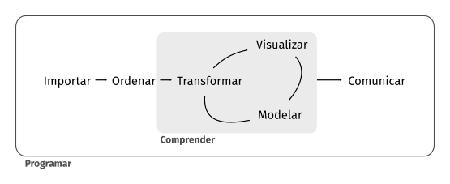
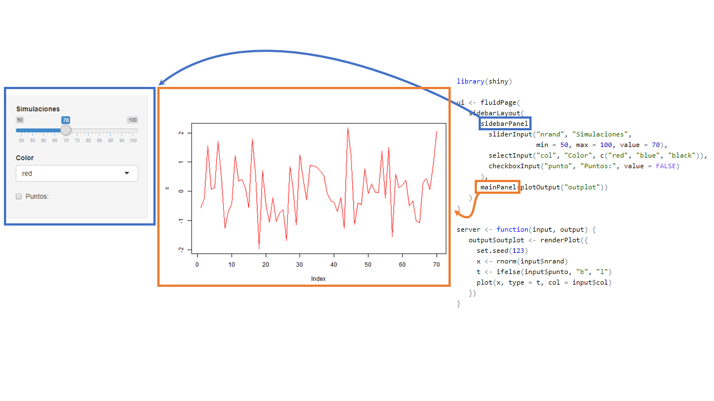
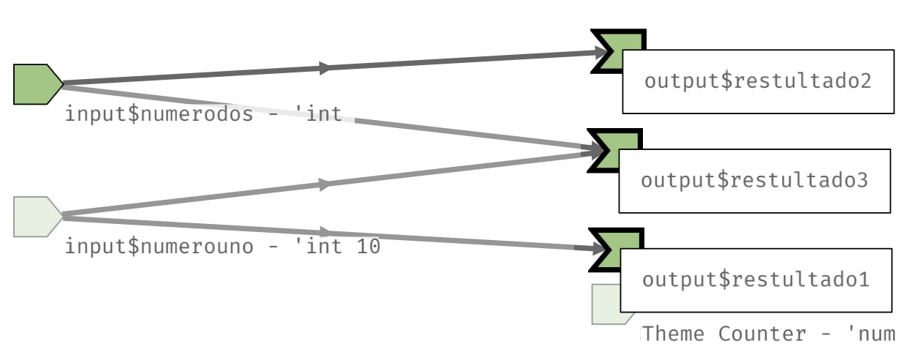
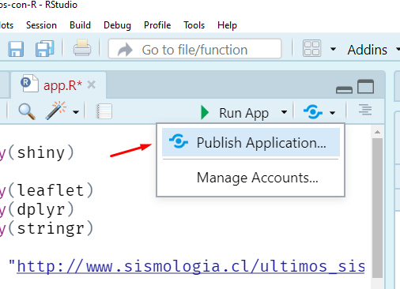

```{r setup, include=FALSE}
source(here::here("slides/xaringan-knitr-setup.R"))
```

class: center, middle, inverse

# Por que shiny?


---

## Por que `shiny`?

<br/>

```{r out.width="70%", fig.align='center', echo=FALSE}

```

---

class: center, middle, inverse

# ¿Qué es una *app*(licación) web?

---

## Aplicación Web

(Wikipedia:) Herramientas que los usuarios pueden utilizar accediendo 
a un servidor web a través de internet o de una intranet mediante un navegador.

Puede ser de lo más simple...

.center[
```{r, echo=FALSE, out.width = "900px", out.}
knitr::include_graphics("images/shiny/miprimerapp.png")
```
]

---

## Aplicación Web

Hasta algo más complejo con más `input`s y `output`s

.center[
```{r, out.width = "800px", echo=FALSE}
knitr::include_graphics("images/shiny/otraapp2.png")
```
]

---

## Ejemplos para motivarse!

Algunos simples.

* https://jjallaire.shinyapps.io/shiny-kmeans/
* https://jbkunst.shinyapps.io/05-arma/ 

--

Otros con más detalle en la parte visual.

* https://github.com/jbkunst/shiny-apps-educational
* https://frzambra.shinyapps.io/odes-unidades-shiny-app/
* https://jbkunst.shinyapps.io/trd-sttstcs/ (https://github.com/jbkunst/trd-sttstcs)
* https://jorgehcas1998.shinyapps.io/Dataton-app/ (https://github.com/socapal/dataton-tudinero)
* https://nz-stefan.shinyapps.io/commute-explorer-2

---

## La estructura de una ShinyApp

```{r, eval=FALSE}
library(shiny)

ui <- fluidPage()

server <- function(input, output) {}

runApp(list(ui = ui, server = server)) 
```

En `shiny`, una aplicación constará de **2** partes:

- La interfaz de usuario, `ui` (user interface), donde definiremos el look de nuestra aplicación, y lugar de  `inputs` y `outputs`.
- El `server`, en donde especificaremos como interactuan los `outputs` en función de los `inputs`.

---

## La estructura de una ShinyApp


```{r, eval=FALSE}
library(shiny)

ui <- fluidPage()                            #<<

server <- function(input, output) {}

runApp(list(ui = ui, server = server)) 
```

- Se define una interfaz de usuario (user interface). En adelante `ui`.
- En este caso es una página fluida vacía `fluidPage()`.
- En el futuro acá definiremos diseño/estructura de nuestra aplicación (_layout_).
Que se refiere la disposición de nuestros `inputs` y `outputs`.


---

## La estructura de una ShinyApp

```{r, eval=FALSE}
library(shiny)

ui <- fluidPage()                            

server <- function(input, output) {}         #<<

runApp(list(ui = ui, server = server)) 
```

- Se define el `server` en donde estará toda la lógica de nuestra aplicación.
- Principalmente serán instrucciones que dependeran de `inputs` y
reflejaremos `outputs`: como tablas, gráficos.

---

## La estructura de una ShinyApp

```{r, eval=FALSE}
library(shiny)

ui <- fluidPage()                            

server <- function(input, output) {}         

runApp(list(ui = ui, server = server))       #<<
```

- `runApp` es la funcion que crea y deja corriendo la app con los 
parámetros otorgados.
- **No siempre** tendremos que escribirla pues veremos que RStudio
al crear una shinyApp nos pondrá un botón para _servir_ la aplicación.

---

## La estructura de una ShinyApp

```{r, eval=FALSE}
library(shiny)

ui <- fluidPage()                            

server <- function(input, output) {}         

runApp(list(ui = ui, server = server))       
```

De formar general la aplicación será:

```{r, eval=FALSE}
library(shiny)
# acá se cargarán paquetes y posiblemente también datos
# necesarios para ui (como definir opciones de inputs)

ui <- fluidPage(
  # código que da forma a nuestrá aplicación: títulos, secciones, textos, inputs
)                            

server <- function(input, output) {
  # toooda la lógica de como interactuan los outputs en función de los inputs
}         
```

---

## Ejercicio 1: Nuestra primer App andando

Hacer funcionar el siguiente `código` en R Rstudio: (hint: sí, copy + paste + run) 

.code40[
```{r, eval=FALSE}
library(shiny)
ui <- fluidPage(
   sidebarLayout(
      sidebarPanel(
        sliderInput("nrand", "Simulaciones", min = 50, max = 100, value = 70),
        selectInput("col", "Color", c("red", "blue", "black")),
        checkboxInput("punto", "Puntos:", value = FALSE)
      ),
      mainPanel(plotOutput("outplot"))
   )
)
server <- function(input, output) {
   output$outplot <- renderPlot({
     set.seed(123)
     x <- rnorm(input$nrand)
     t <- ifelse(input$punto, "b", "l")
     plot(x, type = t, col = input$col)
   })
}
shinyApp(ui, server)
```
]

---

class: center, middle, inverse

# Funcionamiento de una app de Shiny (reactividad)

---

## App


---

## Contenedor 


---

## Otros contenedores 



---

## Inputs 


---

## Outputs


---

## Interacción 


---

## Resultado


---

## La estructura de una ShinyApp 2

```{r, eval=FALSE}
ui <- fluidPage(
   sidebarLayout(
      sidebarPanel(
        sliderInput("nrand", "Simulaciones", min = 50, max = 100, value = 70),
        selectInput("col", "Color", c("red", "blue", "black")),
        checkboxInput("punto", "Puntos:", value = FALSE)
      ),
      mainPanel(plotOutput("outplot"))
   )
)

server <- function(input, output) {
   output$outplot <- renderPlot({
     set.seed(123)
     x <- rnorm(input$nrand)
     t <- ifelse(input$punto, "b", "l")
     plot(x, type = t, col = input$col)
   })
}
```

---

## La estructura de una ShinyApp 2: Contenedores

```{r, eval=FALSE}
ui <- fluidPage(                                                  #<<                                        
   sidebarLayout(                                                 #<<
      sidebarPanel(                                               #<<
        sliderInput("nrand", "Simulaciones", min = 50, max = 100, value = 70),
        selectInput("col", "Color", c("red", "blue", "black")),
        checkboxInput("punto", "Puntos:", value = FALSE)
      ),
      mainPanel(plotOutput("outplot"))                            #<<
   )
)

server <- function(input, output) {
   output$outplot <- renderPlot({
     set.seed(123)
     x <- rnorm(input$nrand)
     t <- ifelse(input$punto, "b", "l")
     plot(x, type = t, col = input$col)
   })
}
``` 

Por ejemplo uso de _tabs_ de _menus_, o páginas
con navegación. [Más detalles](http://shiny.rstudio.com/articles/layout-guide.html).


---

## La estructura de una ShinyApp 2: Inputs

```{r, eval=FALSE}
ui <- fluidPage(                                                                                          
   sidebarLayout(                                                 
      sidebarPanel(                                               
        sliderInput("nrand", "Simulaciones", min = 50, max = 100, value = 70),             #<<
        selectInput("col", "Color", c("red", "blue", "black")),   #<<
        checkboxInput("punto", "Puntos:", value = FALSE)          #<<
      ),
      mainPanel(plotOutput("outplot"))                            
   )
)

server <- function(input, output) {
   output$outplot <- renderPlot({
     set.seed(123)
     x <- rnorm(input$nrand)
     t <- ifelse(input$punto, "b", "l")
     plot(x, type = t, col = input$col)
   })
}
``` 

[Más ejemplos](https://shiny.rstudio.com/gallery/widget-gallery.html). En R
se usan como numericos, strings, booleanos, fechas, ...

---

## La estructura de una ShinyApp 2: Outputs

```{r, eval=FALSE}
ui <- fluidPage(                                                                                          
   sidebarLayout(                                                 
      sidebarPanel(                                               
        sliderInput("nrand", "Simulaciones", min = 50, max = 100, value = 70),             
        selectInput("col", "Color", c("red", "blue", "black")),   
        checkboxInput("punto", "Puntos:", value = FALSE)          
      ),
      mainPanel(plotOutput("outplot"))                            #<<                       
   )
)

server <- function(input, output) {
   output$outplot <- renderPlot({
     set.seed(123)
     x <- rnorm(input$nrand)
     t <- ifelse(input$punto, "b", "l")
     plot(x, type = t, col = input$col)
   })
}
``` 

Existen varios outpus como tablas, texto, imágenes, mapas, etc.

---

## La estructura de una ShinyApp 2: Renders

```{r, eval=FALSE}
ui <- fluidPage(                                                                                          
   sidebarLayout(                                                 
      sidebarPanel(                                               
        sliderInput("nrand", "Simulaciones", min = 50, max = 100, value = 70),             
        selectInput("col", "Color", c("red", "blue", "black")),   
        checkboxInput("punto", "Puntos:", value = FALSE)          
      ),
      mainPanel(plotOutput("outplot"))                                                   
   )
)

server <- function(input, output) {
   output$outplot <- renderPlot({                               #<<
     set.seed(123)
     x <- rnorm(input$nrand)
     t <- ifelse(input$punto, "b", "l")
     plot(x, type = t, col = input$col)
   })
}
``` 

Envian la información/objeto al output. Adentro hay código R.

---

## La estructura de una ShinyApp 2: Lógica (código R!)

```{r, eval=FALSE}
ui <- fluidPage(                                                                                          
   sidebarLayout(                                                 
      sidebarPanel(                                               
        sliderInput("nrand", "Simulaciones", min = 50, max = 100, value = 70),             
        selectInput("col", "Color", c("red", "blue", "black")),   
        checkboxInput("punto", "Puntos:", value = FALSE)          
      ),
      mainPanel(plotOutput("outplot"))                                                   
   )
)

server <- function(input, output) {
   output$outplot <- renderPlot({                               
     set.seed(123)                                              #<<
     x <- rnorm(input$nrand)                                    #<<
     t <- ifelse(input$punto, "b", "l")                         #<<
     plot(x, type = t, col = input$col)                         #<<
   })
}
``` 

Acá usamos los inputs para entregar lo que deseamos (outputs).

---

## La estructura de una ShinyApp 2: *Output() y render*()

<pre class="r hljs remark-code">
ui <- fluidPage(                                                                                          
   sidebarLayout(                                                 
      sidebarPanel(                                               
        sliderInput("nrand", "Simulaciones", min = 50, max = 100, value = 70),             
        selectInput("col", "Color", c("red", "blue", "black")),   
        checkboxInput("punto", "Puntos:", value = FALSE)          
      ),
      mainPanel(<b>plotOutput</b>("outplot"))
   )
)

server <- function(input, output) {
   output$outplot <- <b>renderPlot</b>({                               
     set.seed(123)                                              
     x <- rnorm(input$nrand)                                    
     t <- ifelse(input$punto, "b", "l")                         
     plot(x, type = t, col = input$col)                         
   })
}
</pre>

- Las funciones `*Output()` y `render*()` trabajan juntas para agregar salidas de R a la interfaz de usuario.
 
---

## La estructura de una ShinyApp 2: IDs outpus

<pre class="r hljs remark-code">
ui <- fluidPage(                                                                                          
   sidebarLayout(                                                 
      sidebarPanel(                                               
        sliderInput("nrand", "Simulaciones", min = 50, max = 100, value = 70),             
        selectInput("col", "Color", c("red", "blue", "black")),   
        checkboxInput("punto", "Puntos:", value = FALSE)          
      ),
      mainPanel(plotOutput(<b>"outplot"</b>))
   )
)

server <- function(input, output) {
   output$<b>outplot</b> <- renderPlot({                               
     set.seed(123)                                              
     x <- rnorm(input$nrand)                                    
     t <- ifelse(input$punto, "b", "l")                         
     plot(x, type = t, col = input$col)                         
   })
}
</pre>

- Cada `*Output()` y `render*()` se asocian con un **id** definido por nosotros.

---

## La estructura de una ShinyApp 2: IDs inputs

.code60[
<pre class="r hljs remark-code">
ui <- fluidPage(                                                                                          
   sidebarLayout(                                                 
      sidebarPanel(                                               
        sliderInput(<b>"nrand"</b>, "Simulaciones", min = 50, max = 100, value = 70),             
        selectInput("col", "Color", c("red", "blue", "black")),   
        checkboxInput("punto", "Puntos:", value = FALSE)          
      ),
      mainPanel(plotOutput("outplot"))
   )
)

server <- function(input, output) {
   output$outplot <- renderPlot({                               
     set.seed(123)                                              
     x <- rnorm(input$<b>nrand</b>)                                    
     t <- ifelse(input$punto, "b", "l")                         
     plot(x, type = t, col = input$col)                         
   })
}
</pre>
]

Cada functión `*Input` requiere un **id** para ser identificado en el server.


---

## La estructura de una ShinyApp 2: Más info de inputs

.code60[
<pre class="r hljs remark-code">
ui <- fluidPage(                                                                                          
   sidebarLayout(                                                 
      sidebarPanel(                                               
        sliderInput(<b>"nrand"</b>, "Simulaciones", min = 50, max = 100, value = 70),             
        selectInput(<b>"col"</b>, "Color", c("red", "blue", "black")),   
        checkboxInput(<b>"punto"</b>, "Puntos:", value = FALSE)          
      ),
      mainPanel(plotOutput("outplot"))
   )
)

server <- function(input, output) {
   output$outplot <- renderPlot({                               
     set.seed(123)                                              
     x <- rnorm(input$<b>nrand</b>)                                    
     t <- ifelse(input$<b>punto</b>, "b", "l")                         
     plot(x, type = t, col = input$<b>col</b>)                         
   })
}
</pre>
]

Más inputs [acá](https://gallery.shinyapps.io/065-update-input-demo/) y [acá](http://shinyapps.dreamrs.fr/shinyWidgets/).

---

## Ejercicio 2: Inputs y outputs vengan a mi!


Haga click en:

- _File_, luego _New File_ y _Shiny Web App_, seleccione el nombre
- Ejecutela con _Run App_ e intearctúe
- Luego modifique y cree una app que contenga:
  - 2 inputs, un `sliderInput` y un `textInput` 
  - 3 outputs de tipo texto `textOutput` donde el primero contenga 
el valor del primer input, el segundo el valor del segundo input, y el tercero la suma de los
dos.


Hints importantes:

- No tema a escribir, ni preguntar!
- Está totalmente permitido equivocarse, de hecho se pondrán puntos extras.


---

## Solucion (?)

.code60[
<pre class="r hljs remark-code">
ui <- fluidPage(
    sidebarLayout(
        sidebarPanel(
            sliderInput("numerouno", "#1", min = 10, max = 500, value = 100),
            textInput("numerodos", "#2", value = 3)
        ),
        mainPanel(
           textOutput("resultado1"),
           textOutput("resultado2"),
           textOutput("resultado3")
        )
    )
)

server <- function(input, output) {

  output$resultado1 <- renderText({input$numerouno})
  
  output$resultado2 <- renderText({input$numerodos})
  
  output$resultado3 <- renderText({input$numerouno + input$numerodos})
  
}
</pre>
]


---

## Reactividad: Como funciona shiny

Consideremos la aplicación del ejemplo anterior. 

Al cambiar un input -como lo es `input$numerouno` o `input$numerodos`- shiny
reconoce que expresiones (renders, como `renderText` en este caso) dependen
dichos elementos y vuelve a calcularlos a penas suceda el cambio.

.center[
```{r, out.width = "800px", echo=FALSE}

```
]

En este sentido, shiny funciona similar a excel.

---

class: center, middle, inverse

# Publicar/Servir tu app

---

## Publicar/Servir tu app

Existen dos formas simples/sencillas para compartir una aplicación. Es decir
que sea visible en otros dispositivos pc/móviles. Luego existen otras 
que requieren de mayor conocimiento técnico.

**Vía IP local**: Permite que tu pc sirva la aplicación y pueda ser visible en una red local 
(por ejemplo, la de tu casa), o también en una VPN.

--

**Servicio shinyapps.io**:  Permite que otro pc (una máquina virtual) sirva tu apliación y la exponga 
con una url pública. Ejemplo https://usuario.shinyapps.io/nombreapp.

--

**Otras**: Como por ejemplo arrendar una máquina virtual linode/digitalocean/aws e 
instalar shinyserver.

---

## Vía IP local

- Solamente funciona para redes locales (casa/trabajo) o tambien VPN.
- Requiere que _nuestro_ pc esté encendido para que la app corra.

Básicamente se obtiene la IP (_dirección de nuesto pc_) a través de una instrucción y luego se especifica correr la aplicación con dicha IP. Se deberá cambiar:

```{r, eval=FALSE}
shinyApp(ui = ui, server = server)
```

Por:

```{r, eval=FALSE}
# esto es en windows
ip <- gsub(".*? ([[:digit:]])", "\\1", system("ipconfig", intern=T)[grep("IPv4", system("ipconfig", intern = T))])

shinyApp(ui = ui, server = server, options = list(host = ip))
```

---

## Servicio shinyapps.io

- Básicamente sube todo lo que está en la carpeta de la aplicación archivos R y **otros** 
a una máquina virtual y detecta los paquetes utilizados.
- La versión gratuita tienes horas de uso que se van recuperando cada mes. Está
máquina virtual es humilde en términos de recursos, puede ser lenta dependiendo
del uso.


Primero se debe una cuenta en https://www.shinyapps.io/ (puedes asociar tu correo gmail).
Luego crear una app.
- `rsconnect::deployApp("<ruta_a_la_aplicacion>")`, o:

.center[

]


---

## Paquetes 

Paquetes para realizar aplicaciones web con shiny:

```{r, eval=FALSE}
install.packages(
  c("tidyverse", "shiny", "shinythemes", "shinyWidgets", "bslib",
    "shinydashboard", "DT", "leaflet", "plotly", "highcharter")
  )
```

---

## Más información

- https://jkunst.com/shiny-visualizacion-de-datos-con-R/clase-01.html
- https://mastering-shiny.org/ https://github.com/cienciadedatos/mastering-shiny
- https://shiny.rstudio.com/tutorial/
- https://shiny.rstudio.com/tutorial/written-tutorial/lesson1/
- https://shiny.rstudio.com/images/shiny-cheatsheet.pdf
- https://raw.githubusercontent.com/rstudio/cheatsheets/main/translations/spanish/shiny_es.pdf

